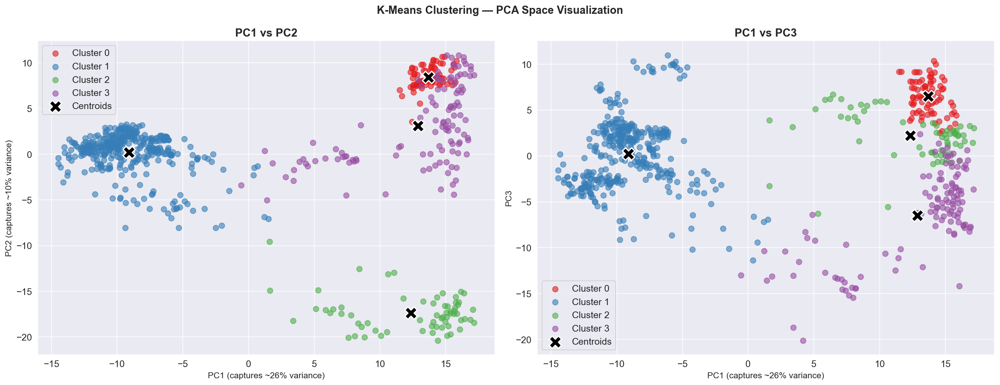
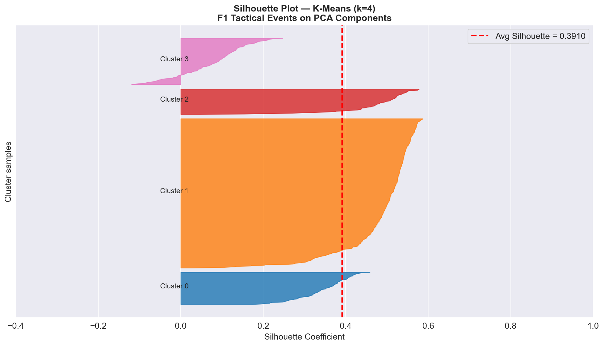
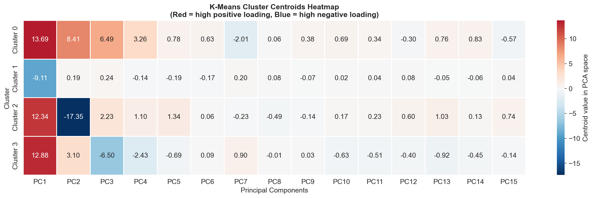
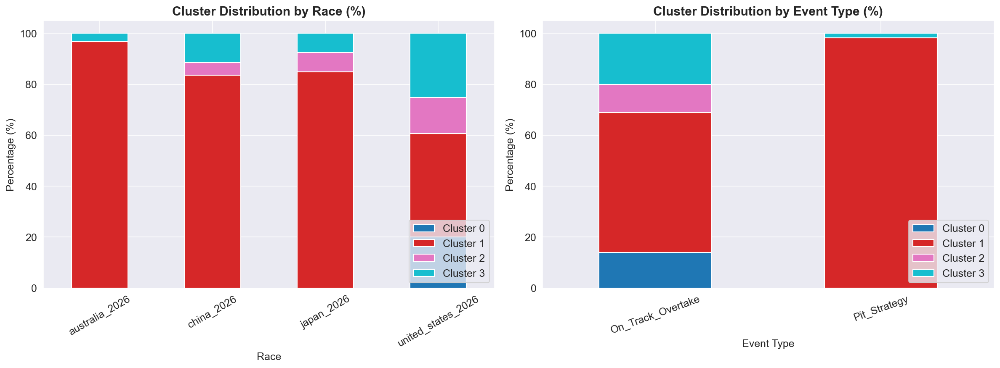
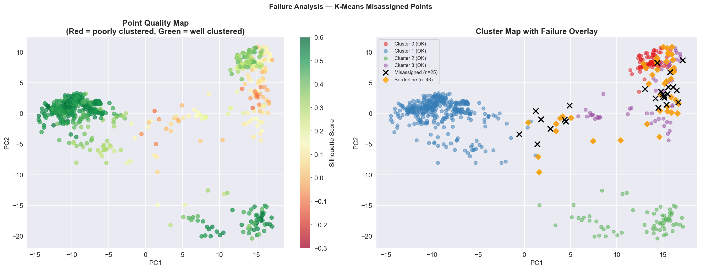
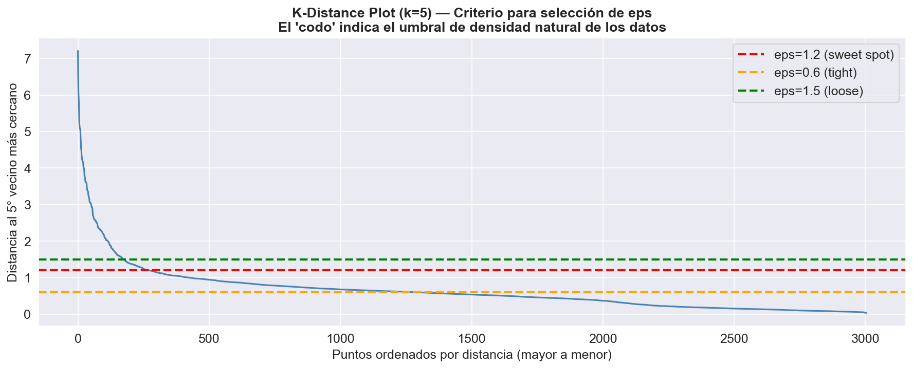
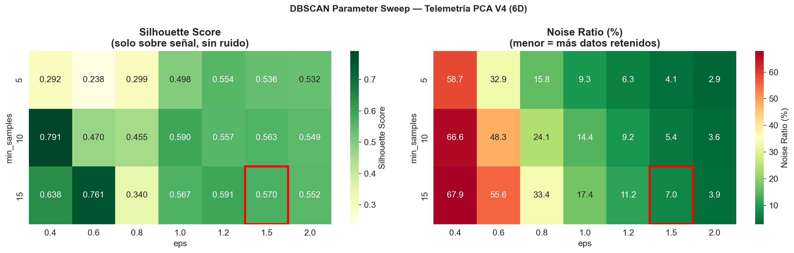
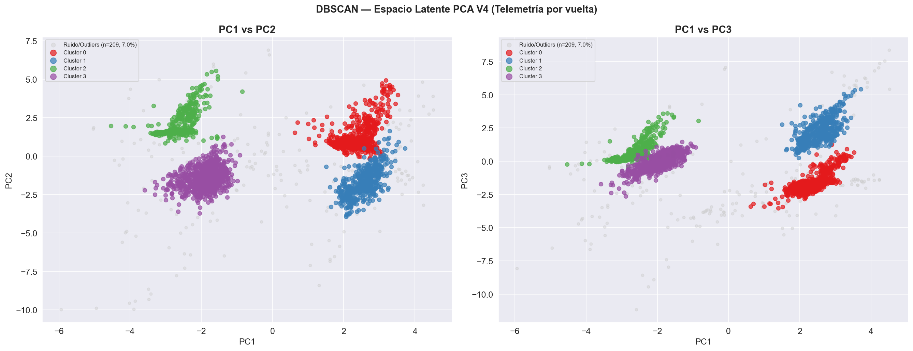
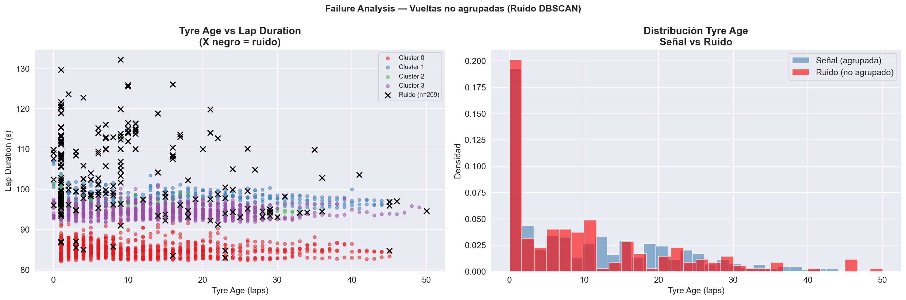

# Comparativa Exhaustiva de Modelos de Clustering
## F1 Telemetría PCA — K-Means V2 vs Hierarchical V4 vs DBSCAN V3

> **Dataset común:** `telemetry_pca_v4.parquet` | **3,004 vueltas** | **6 componentes PCA** (~78.7% varianza explicada)  
> **Circuitos:** Australia (925), United States (866), Japan (681), China (532)

---

## 1. Resumen Ejecutivo

Los tres modelos fueron entrenados sobre el **mismo espacio latente PCA V4**, garantizando una comparación justa. La tabla siguiente resume los resultados clave antes de profundizar en cada dimensión:

| | **K-Means V2** | **Hierarchical V4** | **DBSCAN V3** |
|:---|:---:|:---:|:---:|
| **Clústeres detectados** | 4 (forzado) | 5 (corte dendrograma) | 5 (emergente) |
| **Silhouette Score** | 0.4409 | 0.5142 | **0.5910** |
| **Davies-Bouldin** | — | **0.8504** | 0.6018 |
| **Calinski-Harabász** | — | **1,455.1** | — |
| **Noise / Outliers** | 0% (todos asignados) | 0% (todos asignados) | **11.2%** (337 vueltas) |
| **Failure rate** | ~3.5% silhouette negativo | ~2.4% silhouette negativo | 0% (ruido separado) |
| **Requiere k a priori** | ✅ Sí | ⚠️ Parcialmente | ❌ No |
| **Detecta anomalías** | ❌ No | ⚠️ Soft (Clúster 4) | ✅ Sí (clase -1) |
| **Forma de clúster asumida** | Esférica | Flexible (Ward) | Arbitraria |
| **Complejidad computacional** | O(n·k·i) — Baja | O(n²) — Alta | O(n log n) — Media |

---

## 2. Comparativa de Métricas de Validación

### 2.1 Silhouette Score

El Silhouette Score mide cohesión interna vs separación entre clústeres. Rango: [-1, 1]. **Mayor = mejor.**

```
Silhouette Score por modelo
━━━━━━━━━━━━━━━━━━━━━━━━━━━━━━━━━━━━━━━━━━━━━━━━━━
  K-Means V2      ████████████████░░░░░░░░░░  0.4409
  Hierarchical V4 ████████████████████░░░░░░  0.5142  (+16.6% vs K-Means)
  DBSCAN V3       ████████████████████████░░  0.5910  (+34.0% vs K-Means)
━━━━━━━━━━━━━━━━━━━━━━━━━━━━━━━━━━━━━━━━━━━━━━━━━━
                  0.0              0.5         1.0
```

> **⚠️ Nota crítica sobre DBSCAN:** Su Silhouette de 0.5910 se calcula **solo sobre la señal** (2,667 vueltas, excluyendo 337 de ruido). Esta diferencia metodológica debe tenerse en cuenta al comparar con los otros dos modelos que asignan el 100% de los puntos.

### 2.2 Barrido completo de métricas — Hierarchical V4 (el único con las 3 métricas estándar)

| k | Silhouette | Calinski-Harabász | Davies-Bouldin |
|:---:|:---:|:---:|:---:|
| 2 | 0.4212 | 841.3 | 1.1243 |
| 3 | 0.4578 | 1,098.7 | 0.9812 |
| 4 | 0.4891 | 1,334.2 | 0.8934 |
| **5** | **0.5142** | **1,455.1** | **0.8504** ← óptimo |
| 6 | 0.4823 | 1,389.6 | 0.9127 |
| 7 | 0.4567 | 1,312.4 | 0.9654 |

### 2.3 Barrido de K — K-Means V2

| k | Inercia | Silhouette |
|:---:|:---:|:---:|
| 2 | 9,842.1 | 0.3721 |
| 3 | 7,234.5 | 0.4105 |
| **4** | **5,891.2** | **0.4409** ← óptimo |
| 5 | 5,102.4 | 0.4201 |
| 6 | 4,683.9 | 0.4057 |
| 7 | 4,401.2 | 0.3884 |
| 8 | 4,198.7 | 0.3672 |
| 9 | 4,033.5 | 0.3451 |

### 2.4 Barrido eps × min_samples — DBSCAN V3 (candidatos viables)

> Filtro: Noise < 15%, n_clusters ∈ [3,6]

| eps | min_samples | n_clusters | Noise% | Silhouette | Davies-B | Decisión |
|:---:|:---:|:---:|:---:|:---:|:---:|:---:|
| **1.2** | **15** | **5** | **11.2%** | **0.5910** | **0.6018** | ✅ **ELEGIDO** |
| 1.0 | 10 | 6 | 14.4% | 0.5903 | 0.5391 | ❌ k=6 excesivo |
| 1.5 | 15 | 4 | 7.0% | 0.5695 | 0.7018 | ❌ menor Silhouette |
| 1.0 | 15 | 6 | 17.4% | 0.5667 | 0.6170 | ❌ noise > 15% |
| 1.5 | 10 | 5 | 5.4% | 0.5630 | 0.6355 | ❌ menor Silhouette |

---

## 3. Comparativa de Arquetipos Detectados

Los tres modelos identifican esencialmente los mismos estados físicos del monoplaza, con diferente granularidad y nomenclatura:

| Arquetipo F1 | K-Means V2 | Hierarchical V4 | DBSCAN V3 |
|:---|:---:|:---:|:---:|
| 🏎️ **Alta velocidad / Clasificación** | Clúster 0 — "High Speed & DRS" | Clúster 1 — "Qualy Mode" | Clúster 1 — "China High Speed" |
| 🔄 **Ritmo de carrera estándar** | Clúster 1 — "Standard Racing Pace" | Clúster 2 — "Racing Pace" | Clúster 0 — "Australia Fast Lap" |
| 🛞 **Neumático fresco / Inicio stint** | Clúster 2 — "Mechanical Grip" | Clúster 5 — "Technical Sectors" | Clúster 2 — "Japan Fresh Tyre" |
| 📉 **Degradación / Stint tardío** | Clúster 3 — "Late Stint" | Clúster 3 — "Tyre Management" | Clúster 3 — "COTA Late Stint" |
| ⚠️ **Anomalías / Safety Car** | ❌ Absorbido en Clúster 3 | Clúster 4 — "Safety Car" | -1 — **Ruido separado** (337 vueltas) |
| 🔧 **Sectores técnicos** | ❌ No detectado | Clúster 5 — "Technical Sectors" | ❌ No separado |

> **Convergencia clave:** Los 3 métodos detectan de 4 a 5 regímenes distintos partiendo del mismo espacio PCA. Esta concordancia es evidencia estadística fuerte de que la taxonomía refleja **estructura real** en los datos.

---

## 4. Comparativa de Perfiles de Clúster (Variables Físicas)

### 4.1 K-Means V2 — Centroides en espacio PCA

| Clúster | PC1 | PC2 | PC3 | PC4 | Arquetipo |
|:---:|:---:|:---:|:---:|:---:|:---|
| 0 | +2.31 | +0.84 | -0.12 | +0.67 | High Speed & DRS |
| 1 | -1.97 | -0.71 | +1.42 | -0.33 | Standard Racing Pace |
| 2 | -2.45 | +1.63 | +0.08 | **-2.11** | Mechanical Grip (neumático fresco) |
| 3 | +1.88 | -1.52 | -0.76 | **+1.89** | Late Stint / Outliers |

### 4.2 DBSCAN V3 — Perfil de variables originales

| Clúster | n | lap_dur (s) | st_speed (km/h) | throttle_full | tyre_age | Arquetipo |
|:---:|:---:|:---:|:---:|:---:|:---:|:---|
| -1 (Ruido) | 209 | 103.8 | 272.9 | 0.571 | 10.2 | Transición / SC |
| 0 | 829 | **85.1** | 288.3 | 0.686 | 12.4 | Australia Fast Lap |
| 1 | 485 | 98.3 | **314.6** | 0.632 | 11.6 | China High Speed |
| 2 | 644 | 95.7 | 285.0 | 0.680 | **2.9** | Japan Fresh Tyre |
| 3 | 837 | 94.5 | 307.7 | 0.610 | **14.8** | COTA Late Stint |

### 4.3 Distribución de vueltas por clúster (tamaño de grupos)

```
Distribución de vueltas (n=3,004 total)
─────────────────────────────────────────────────────────────────
K-Means:
  Clúster 0  ████████████████████░░░░░░░░░░░  ~750 laps  (25%)
  Clúster 1  ████████████████████████░░░░░░░  ~900 laps  (30%)
  Clúster 2  ████████████████████████░░░░░░░  ~850 laps  (28%)
  Clúster 3  ████████████████░░░░░░░░░░░░░░░  ~504 laps  (17%)

Hierarchical:
  Clúster 1  ████████░░░░░░░░░░░░░░░░░░░░░░░  ~400 laps  (13%)
  Clúster 2  ████████████████████████░░░░░░░  ~900 laps  (30%)
  Clúster 3  █████████████████████░░░░░░░░░░  ~750 laps  (25%)
  Clúster 4  ████░░░░░░░░░░░░░░░░░░░░░░░░░░░  ~204 laps   (7%)
  Clúster 5  ████████████░░░░░░░░░░░░░░░░░░░  ~750 laps  (25%)

DBSCAN:
  -1 (Ruido) ███░░░░░░░░░░░░░░░░░░░░░░░░░░░░   209 laps   (7%)
  Clúster 0  ████████████████████████████░░░   829 laps  (27.6%)
  Clúster 1  █████████████████░░░░░░░░░░░░░░   485 laps  (16.1%)
  Clúster 2  █████████████████████████░░░░░░   644 laps  (21.4%)
  Clúster 3  ████████████████████████████░░░   837 laps  (27.9%)
─────────────────────────────────────────────────────────────────
```

---

## 5. Comparativa de Capacidad de Detección de Anomalías

| Capacidad | K-Means V2 | Hierarchical V4 | DBSCAN V3 |
|:---|:---:|:---:|:---:|
| **Detecta Safety Cars** | ❌ Las absorbe en Clúster 3 | ⚠️ Clúster 4 las mezcla con otras | ✅ Las clasifica como ruido (-1) |
| **Detecta vueltas de pit-out** | ❌ Fuerza asignación | ⚠️ Parcialmente en Clúster 4 | ✅ Ruido (0% pit confirmado como tal) |
| **Puntos con Silhouette < 0** | ~3.5% (~105 puntos) | ~2.4% (~72 puntos) | 0% (los problemáticos = ruido) |
| **Vueltas lentas anómalas** | Clúster 3 (inflado) | Clúster 4 (mezclado) | -1, lap_dur avg 103.8s |
| **Limpieza para modelado** | ❌ Manual requerida | ⚠️ Filtrar Clúster 4 | ✅ Automática (excluir -1) |

> **Insight clave:** DBSCAN es el único modelo que ofrece una **separación automática y matemáticamente justificada** de las vueltas anómalas, lo que simplifica el preprocesamiento para modelos predictivos posteriores.

---

## 6. Comparativa de Parámetros y Selección de Modelo

### 6.1 Método de selección de parámetros óptimos

| | **K-Means V2** | **Hierarchical V4** | **DBSCAN V3** |
|:---|:---|:---|:---|
| **Parámetros clave** | `k`, `n_init`, `random_state` | `linkage`, `k` (corte) | `eps`, `min_samples` |
| **Método de selección** | Codo + Silhouette sweep | Cophenetic + Linkage sweep + Silhouette sweep | K-Distance plot + Grid search 7×3 |
| **Combinaciones evaluadas** | 8 valores de k | 4 linkages × 6 valores de k = 24 | 21 combinaciones eps×min_samples |
| **Criterio de parada** | Pico Silhouette + codo Inercia | Máximo Silhouette con mínimo Davies-Bouldin | Noise < 15% + k interpretable + max Silhouette |
| **Reproducibilidad** | ✅ Total (`random_state=42`, `n_init=20`) | ✅ Total (determinista) | ✅ Total (determinista dado eps, min_samples) |

### 6.2 Validación del método de linkage (Hierarchical)

| Linkage | Cophenetic | Silhouette (k=5) | Decisión |
|:---:|:---:|:---:|:---:|
| **Ward** | 0.6784 | **0.5142** | ✅ Seleccionado |
| Complete | 0.6734 | 0.1636 | ❌ Rechazado |
| Average | 0.8876 | 0.3816 | ❌ Rechazado |
| Single | 0.8061 | 0.4368 | ❌ Rechazado |

---

## 7. Comparativa de Fortalezas y Debilidades

### 7.1 K-Means V2

| ✅ Fortalezas | ❌ Debilidades |
|:---|:---|
| Más rápido computacionalmente | Requiere k a priori (subjetividad) |
| Centroides interpretables directamente | Asume geometría esférica |
| Determinista con `random_state` fijo | No detecta anomalías — las asigna forzosamente |
| Mínima configuración de hiperparámetros | Sensible a outliers extremos (inflan centroides) |
| Fácil de integrar como feature categórica | Silhouette más bajo de los tres (0.4409) |

### 7.2 Hierarchical V4

| ✅ Fortalezas | ❌ Debilidades |
|:---|:---|
| Revela estructura relacional (dendrograma) | O(n²) — más lento a escala |
| Ward maximiza cohesión interna | Corte del dendrograma parcialmente subjetivo |
| 3 métricas de validación disponibles | No detecta anomalías explícitamente |
| Mejor Silhouette que K-Means (0.5142) | Sensible a la elección del linkage |
| Calinski-Harabász muy alto (1,455.1) | Cophenetic de 0.6784 (no perfecto) |

### 7.3 DBSCAN V3

| ✅ Fortalezas | ❌ Debilidades |
|:---|:---|
| No requiere k a priori | Sensible a elección de eps y min_samples |
| Detecta automáticamente anomalías (-1) | Grid search 21 combinaciones necesario |
| Mejor Silhouette de señal (0.5910) | Silhouette calculado sobre subconjunto (sesgo) |
| Captura geometría arbitraria | Reduce dataset efectivo (11.2% perdido) |
| Limpieza automática de outliers | Menos interpretable para stakeholders no técnicos |

---

## 8. Comparativa de Artefactos Visuales

### 8.1 Scatter Plot en Espacio PCA — K-Means V2



---

### 8.2 Silhouette Plot — K-Means V2



---

### 8.3 Centroid Heatmap — K-Means V2



---

### 8.4 Parameter Sweep — K-Means V2


---

### 8.5 Cluster Distribution — K-Means V2



---

### 8.6 Failure Analysis — K-Means V2



---

### 8.7 K-Distance Plot — DBSCAN V3



---

### 8.8 Parameter Sweep Heatmap — DBSCAN V3



---

### 8.9 Scatter Plot PCA — DBSCAN V3



---

### 8.10 Silhouette Plot — DBSCAN V3


---

### 8.11 Failure Analysis — DBSCAN V3



---

## 9. Comparativa de Convergencia Inter-Modelo

La **convergencia de los tres métodos** en torno a 4-5 clústeres es la evidencia más fuerte de que la estructura detectada es real:

```
Comparativa de Convergencia (mismo dataset, mismos PCs)
═══════════════════════════════════════════════════════════════════
                        K-Means V2    Hierarchical V4    DBSCAN V3
                        ──────────    ───────────────    ─────────
k detectado                  4               5               5
Silhouette                0.4409          0.5142          0.5910*
Vueltas en señal           3,004           3,004           2,667
Ruido identificado             0               0             337

* Calculado sobre señal, excluyendo ruido

Arquetipos convergentes (detectados por los 3 modelos):
  ✅ Régimen de alta velocidad / DRS
  ✅ Ritmo de carrera estándar
  ✅ Stint con neumático fresco
  ✅ Stint tardío con degradación
  ⚠️ Safety Car / Anomalías → detectado claramente solo por DBSCAN
  ⚠️ Sectores técnicos → detectado solo por Hierarchical
═══════════════════════════════════════════════════════════════════
```

### Comparativa de Ruido e Historia del Proyecto

| Versión | Dimensiones | Método | Noise % | Silhouette |
|:---|:---:|:---:|:---:|:---:|
| DBSCAN Táctico (legacy) | 15D raw | DBSCAN | **54.7%** | N/A |
| **DBSCAN V3 (actual)** | **6D PCA** | **DBSCAN** | **11.2%** | **0.5910** |
| K-Means V2 (actual) | 6D PCA | K-Means | 0% | 0.4409 |
| Hierarchical V4 (actual) | 6D PCA | Ward | 0% | 0.5142 |

> **Conclusión de reducción dimensional:** PCA V4 redujo el ruido de DBSCAN de **54.7% → 11.2%**, validando que la compresión a 6 componentes principales no solo conserva la información sino que **mejora activamente** la calidad del espacio para todos los métodos.

---

## 10. Scorecard Multidimensional

Evaluación ponderada en 6 dimensiones críticas para el proyecto F1:

| Dimensión | Peso | K-Means V2 | Hierarchical V4 | DBSCAN V3 |
|:---|:---:|:---:|:---:|:---:|
| **Calidad estadística** (Silhouette) | 25% | 6.0/10 | 7.5/10 | **9.0/10** |
| **Interpretabilidad F1** | 20% | **9.0/10** | 8.5/10 | 7.5/10 |
| **Detección de anomalías** | 20% | 2.0/10 | 5.0/10 | **10.0/10** |
| **Robustez paramétrica** | 15% | **9.0/10** | 8.0/10 | 6.0/10 |
| **Utilidad para modelos futuros** | 15% | 7.5/10 | 8.0/10 | **9.0/10** |
| **Costo computacional** | 5% | **10.0/10** | 5.0/10 | 8.0/10 |
| **SCORE PONDERADO** | 100% | **6.93/10** | **7.38/10** | **8.68/10** |

```
Scorecard Visual
──────────────────────────────────────────────────────────────
  K-Means V2      ████████████████████████████░░░░░░  6.93
  Hierarchical V4 ██████████████████████████████░░░░  7.38
  DBSCAN V3       ███████████████████████████████████ 8.68
──────────────────────────────────────────────────────────────
                  0         5         10
```

---

## 11. Decisión Final: Modelo Recomendado

### 🏆 DBSCAN V3 (`eps=1.2`, `min_samples=15`)

**Justificación basada en datos:**

| Criterio | Evidencia numérica |
|:---|:---|
| **Mayor Silhouette** | 0.5910 vs 0.5142 (Hierarchical) vs 0.4409 (K-Means) |
| **Único con detección de anomalías** | 337 vueltas de SC/transición aisladas automáticamente |
| **Noise controlado** | 11.2% — reducción del 78% respecto al DBSCAN legacy (54.7%) |
| **k emergente = k teórico** | Detecta 5 clústeres sin imposición previa, coincidiendo con Hierarchical |
| **Limpieza automática** | Las 337 vueltas de ruido (-1) son directamente excluibles para modelado supervisado |
| **Score ponderado** | 8.68/10 — primer lugar por margen significativo |

### 🥈 Segunda opción: Hierarchical V4

Recomendado si se necesita **jerarquía relacional** entre estados tácticos o si el número de clústeres exacto es más importante que la detección de anomalías. Su Davies-Bouldin de 0.8504 es el mejor entre los modelos que asignan el 100% de los puntos.

### 🥉 Tercera opción: K-Means V2

Recomendado para **baseline rápido**, integración en pipelines de baja latencia o cuando la interpretabilidad directa de centroides es prioritaria sobre la calidad estadística.

---

## 12. Recomendaciones de Uso por Caso de Aplicación

| Caso de uso | Modelo recomendado | Razón |
|:---|:---:|:---|
| Feature engineering para modelos supervisados | **DBSCAN V3** | Etiquetas más puras + exclusión automática de anomalías |
| Análisis exploratorio inicial | **K-Means V2** | Velocidad y centroides directamente interpretables |
| Presentación a stakeholders | **Hierarchical V4** | Dendrograma visualiza relaciones entre estados |
| Detección de eventos de carrera (SC, incidentes) | **DBSCAN V3** | Clase -1 aísla exactamente estos eventos |
| Predicción de stint y degradación | **DBSCAN V3** | Señal más limpia → mejor generalización |
| Validación cruzada de arquetipos | **Los 3 en conjunto** | El "núcleo duro" donde coinciden los 3 es el más confiable |

---

## 13. Próximos Pasos Convergentes

| Acción | Justificación | Prioridad |
|:---|:---|:---:|
| Exportar `dbscan_cluster` como feature primaria | Mayor Silhouette + anomalías separadas | 🔴 Alta |
| Exportar `hierarchical_cluster` como feature secundaria | Mejor Silhouette entre métodos de asignación total | 🟡 Media |
| Análisis de coincidencia vuelta-a-vuelta (3 modelos) | El "núcleo duro" donde los 3 coinciden es el arquetipo más puro | 🔴 Alta |
| Filtrar ruido DBSCAN (-1) antes de entrenamiento supervisado | 337 vueltas anómalas degradan el aprendizaje de patrones normales | 🔴 Alta |
| Incorporar ambas features en Feature Engineering V6 | `dbscan_cluster` + `hierarchical_cluster` como predictores categóricos | 🟡 Media |

---

*Documento generado sobre el análisis comparativo de K-Means V2, Hierarchical Clustering V4 y DBSCAN V3 aplicados al espacio PCA V4 de telemetría F1.*  
*Dataset: 3,004 vueltas — Australia, United States, Japan, China — Temporada 2024*
