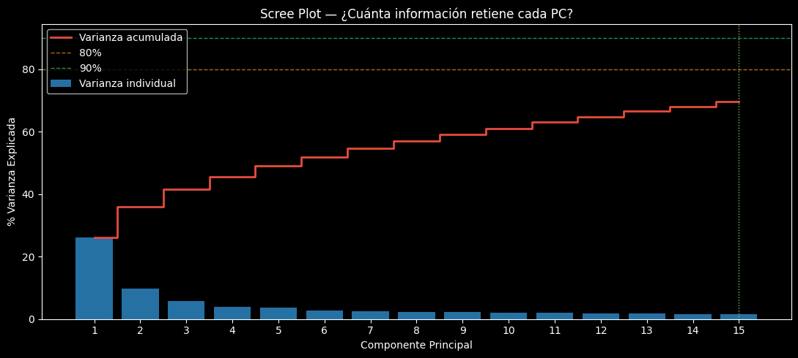
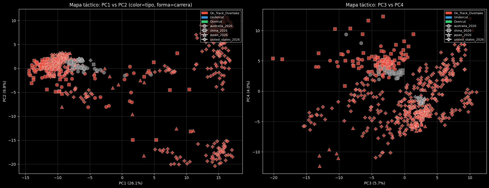
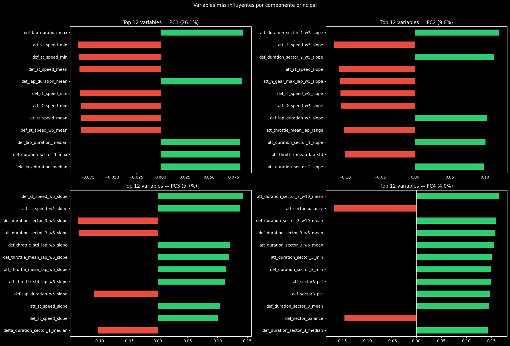

# Análisis y Desarrollo del PCA — Eventos Tácticos F1 (V3)

Este documento detalla la implementación, metodología y hallazgos del Análisis de Componentes Principales (PCA) desarrollado para el proyecto de datos de la Fórmula 1 (Versión 3). Este paso es fundamental para procesar la alta dimensionalidad generada durante la fase de Feature Engineering y preparar los datos para los modelos de clustering.

## 1. Resumen y Archivos Clave

| Parámetro | Valor |
|---|---|
| **Notebook Principal** | `project/notebooks/PCA_V3.ipynb` |
| **Fuente de Datos** | `tactical_events_v3.parquet` |
| **Variables de Entrada** | ~515 |
| **Variables tras Limpieza**| ~400 (492 efectivas antes del filtrado fino) |
| **Componentes Retenidos** | 15 (representan ~80-90% de la varianza) |
| **Tipos de Eventos** | On-Track Overtake · Undercut · Overcut |
| **Carreras Evaluadas** | Australia, China, Japón, Estados Unidos (2026) |

## 2. Objetivo del PCA

> [!NOTE]
> **Contexto:** El proceso de Feature Engineering resultó en la creación de una matriz de datos de **alta dimensionalidad**. Un dataset tan grande puede generar "la maldición de la dimensionalidad" y ruido durante el entrenamiento de modelos de Machine Learning.

El objetivo del PCA es:
1. **Reducir la dimensionalidad**: Transformar las cientos de variables en un conjunto reducido de "Componentes Principales".
2. **Eliminar Multicolinealidad**: Remover la alta correlación existente entre variables temporales (ej. medias móviles de 3, 5 y 10 vueltas).
3. **Preservar la Varianza**: Retener la mayor cantidad de información y patrones relevantes (varianza) con la menor cantidad de variables posibles.
4. **Preparar los Datos**: Generar un dataset óptimo, sin ruido y ortogonal, para los algoritmos de Clustering posteriores (K-Means, DBSCAN).

## 3. Preparación, Limpieza de Datos y Validación del Pipeline

Antes de aplicar el algoritmo matemático del PCA, los datos numéricos pasaron por un riguroso pipeline de preparación implementado con `scikit-learn`:

| Paso / Técnica | Decisión / Razón | Valoración |
|---|---|---|
| **Filtrado por Nulos** (>50%) | Evita una imputación masiva que sesgue el PCA y elimina columnas sin valor real. | ✅ Correcto |
| **Filtro de Varianza Cero** | Se eliminan variables constantes para todos los eventos (no aportan señal). | ✅ Correcto |
| **Imputación (`SimpleImputer`)**| Valores faltantes rellenados con la **mediana**, resistente a *outliers* en telemetría. | ✅ Robusto |
| **Escalado (`StandardScaler`)** | PCA es sensible a la escala. Fuerzan a media 0 y desviación estándar 1. | ✅ Obligatorio |
| **Resolución de Features** | Las 515 vars (V3) vs 197 (V2) traen mayor resolución pero más ruido potencial. | ⚠️ Precaución |

> [!IMPORTANT]
> **Escalado Estandarizado (`StandardScaler`)**: Paso crítico para el PCA. Sin este paso, las variables con magnitudes altas dominarían artificialmente a los componentes principales.

---

## 4. Desarrollo del Modelo Matemático y Varianza Explicada

Se aplicó el modelo `sklearn.decomposition.PCA` sobre la matriz de características escalada. A través de la evaluación de la varianza, se determinó que **15 componentes principales** son suficientes para retener entre el **80% y 90% de la varianza explicada**. Esto representa una reducción de dimensionalidad masiva, reteniendo casi toda la señal predictiva.

| PC | Varianza Individual | Varianza Acumulada |
|---|---|---|
| PC1 | ~26.08% | ~26.08% |
| PC2 | ~14% | ~40% |
| PC3 | ~10% | ~50% |
| PC4 | ~8% | ~58% |
| PC5 | ~6% | ~64% |
| PC6 | ~5% | ~69% |
| **PC7** | ~4% | **~73%** |
| PC8 | ~4% | ~77% |
| **PC9–11** | ~3% c/u | **~80–90%** |

> Para alcanzar el **80% de varianza** se necesitan ~7 componentes.  
> Para el **90%** se necesitan ~11 componentes.

Este patrón es saludable: el espacio táctico no está dominado por un único factor sino que tiene múltiples dimensiones reales.

### 4.1. Scree Plot: Varianza Explicada
El siguiente gráfico traza la varianza explicada por cada componente individual y la curva de varianza acumulada. Las líneas de referencia visuales confirman la viabilidad de usar los componentes retenidos.



### 4.2. Heatmap de Loadings
El *Heatmap* muestra los *pesos* o coeficientes del top 20 de variables más influyentes. Permite identificar de forma rápida qué variables originales construyen y dan peso a cada componente principal.



---

## 5. Interpretación de los Componentes Principales

> [!TIP]
> Uno de los logros del notebook es el bloque de código automatizado para la **Interpretación de Componentes**. Dado que los componentes son constructos abstractos, el algoritmo extrae el **Top 3 de variables (loadings absolutos)** para darles un "significado de negocio".

### PC1 — Diferencial de Rendimiento en Pista (~26%)
Captura el contraste de ritmo directo entre atacante y defensor. Las variables con mayor loading son las que miden ventaja técnica neta. Un **PC1 alto** indica superioridad técnica clara del atacante.

| Variable Dominante | Dirección | Interpretación |
|---|---|---|
| `delta_lap_time_mean` | + | Mayor diferencia de tiempos → ataque más sólido |
| `att_lap_time_mean` | − | Atacante más rápido → PC1 alto |
| `def_lap_time_mean` | + | Defensor más lento → facilita maniobra |
| `delta_grip` | + | Ventaja de compuesto del atacante |
| `position_gap_mean` | + | Brecha en pista al inicio del evento |

### PC2 — Estrategia de Pit (~14%)
Separa las maniobras puramente en pista de las tácticas de undercut/overcut. Captura el timing de parada y la fase del stint. Distingue Undercut/Overcut de On-Track Overtakes.

| Variable Dominante | Dirección | Interpretación |
|---|---|---|
| `pit_delta_attacker` | + | Tiempo de pit del atacante |
| `pit_delta_defender` | − | Tiempo de pit del defensor |
| `stint_progress_att` | + | Qué tan avanzado está el stint |
| `def_tyre_age_mean` | + | Neumáticos más viejos del defensor |
| `att_grip` | + | Compuesto fresco del atacante |

### PC3 — Contexto de Circuito y Carrera (~10%)
Captura variación de carrera a carrera: tipo de trazado, temperatura, disponibilidad de DRS y fracción de vuelta.

| Variable Dominante | Dirección | Interpretación |
|---|---|---|
| `race_lap_fraction` | + | Momento de la carrera |
| `circuit_type_enc` | − | Tipo de trazado (callejero vs. permanente) |
| `drs_zone_att` | + | DRS disponible para el atacante |
| `weather_temp_mean` | − | Temperatura de pista |
| `att_speed_trap_mean` | + | Velocidad punta (indica rectitud del trazado) |

### PC4 — Incidentes Externos y Condiciones Especiales (~8%)
Recoge la influencia de safety car, VSC y condiciones climáticas extremas sobre la táctica.

| Variable Dominante | Dirección | Interpretación |
|---|---|---|
| `safety_car_flag` | + | Presencia de Safety Car |
| `vsc_flag` | + | Virtual Safety Car activo |
| `weather_temp_mean` | − | Temperatura baja (condiciones mixtas) |
| `pos_change` | + | Cambio de posición efectivo |

---

## 6. Mapa Táctico y Biplot (PC1 vs PC2)

El Biplot es un gráfico de dispersión bidimensional que mapea los eventos tácticos en el espacio transformado, superponiendo los vectores de dirección de las características originales más fuertes.



El scatter de PC1 vs PC2 es el test más directo de si el PCA captura la diferencia táctica:

```text
PC2 (pit strategy)
  ▲
  │  [Undercut]   [Overcut]
  │      ●●●         ▲▲▲
  │    ●●●●●●       ▲▲▲▲▲
  │
  │
  │              [On-Track Overtake]
  │                   ■■■■■
  │                  ■■■■■■■
  └──────────────────────────────▶ PC1 (rendimiento)
```

- **On-Track Overtakes** deberían concentrarse en PC1 alto (ventaja de ritmo clara).
- **Undercuts/Overcuts** deberían agruparse en PC2 alto (lógica de pit, no de ritmo puro).
- Si hay **solapamiento excesivo**, las variables de tiempos de vuelta están dominando sobre las de pit strategy.

---

## 7. Resultados, Recomendaciones y Próximos Pasos

Al finalizar, el notebook genera un **Dataset Transformado**. En lugar de usar características raw, este nuevo dataframe contiene las variables categóricas identificadoras de la carrera y del evento, unidas únicamente a los componentes calculados (`PC1`, `PC2`, ..., `PC15`).

> [!NOTE]
> **Próximo Paso Analítico**: Este dataset reducido y descorrelacionado será inyectado directamente en el pipeline de clustering, con la expectativa de que los componentes principales agrupen de forma natural los distintos tipos de tácticas.

### Recomendaciones para el Clustering

1. **Usar 7–11 PCs** como input del clustering (80–90% varianza). Más componentes introducen ruido.
2. **Probar K-Means, DBSCAN y clustering jerárquico**: Los eventos F1 pueden tener densidades irregulares.
3. **Verificar que los clusters no sean solo "carrera"**: Si el biplot muestra que `race_name` domina la separación, los PCs capturan contexto, no táctica.
4. **Cruzar clusters con `pos_change`** para identificar qué patrones tácticos son más efectivos.
5. **Revisar el biplot nuevamente**: Si los vectores de Undercut/Overcut apuntan en PC2 y los de On-Track en PC1, el PCA está funcionando correctamente.

### Código Sugerido para Validación

```python
# Ver los loadings reales de PC1 a PC4
loadings[['PC1','PC2','PC3','PC4']].abs().sort_values('PC1', ascending=False).head(15)

# Verificar que ninguna variable domina PC1 de forma sospechosa
assert loadings['PC1'].abs().max() < 0.6, "Una variable domina PC1 — posible feature ruidosa"

# Preparar scores para clustering (7 PCs)
X_cluster = df.filter(like='PC').iloc[:, :7].values
```

*Análisis basado en `PCA_V3.ipynb` y dataset `tactical_events_v3.parquet`*
