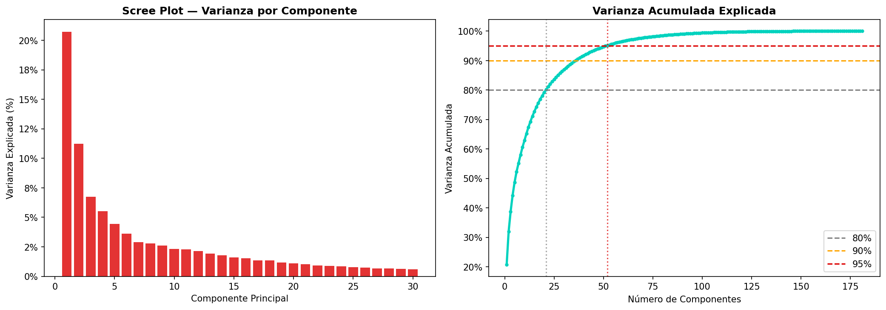
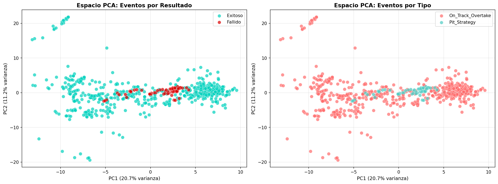
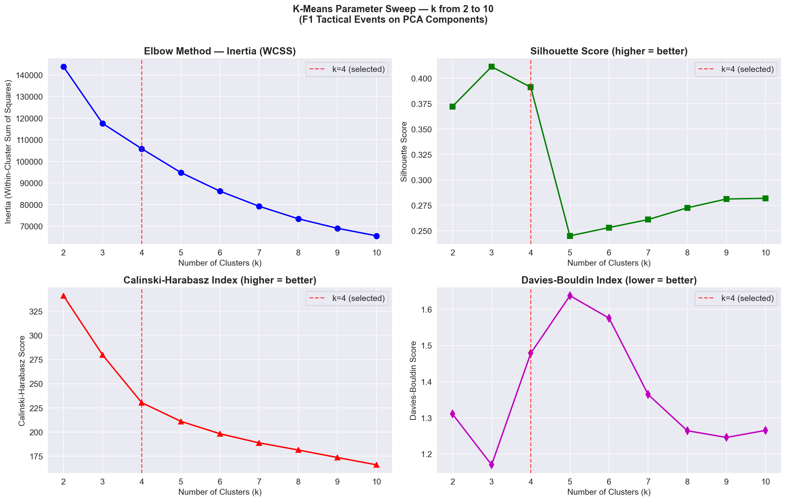
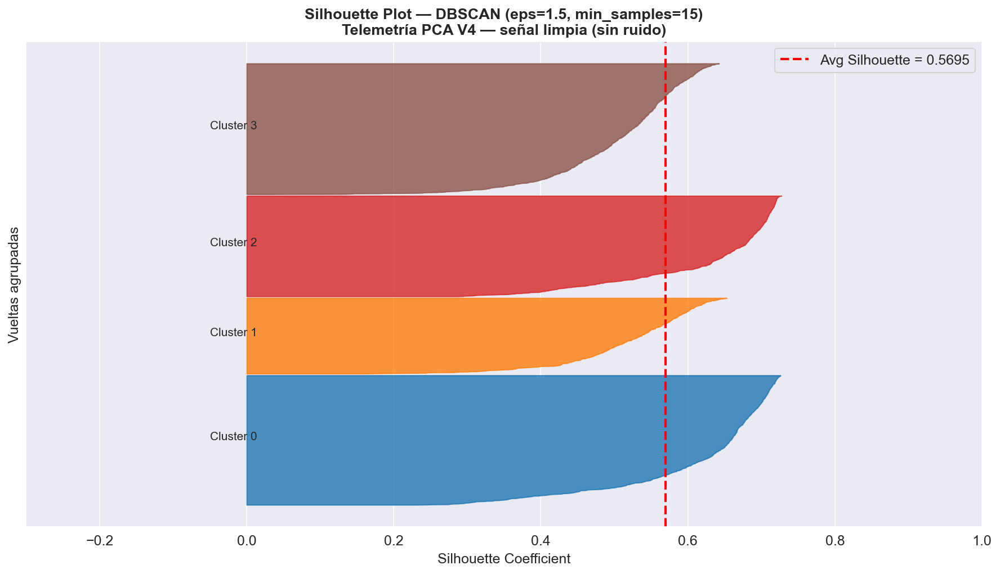
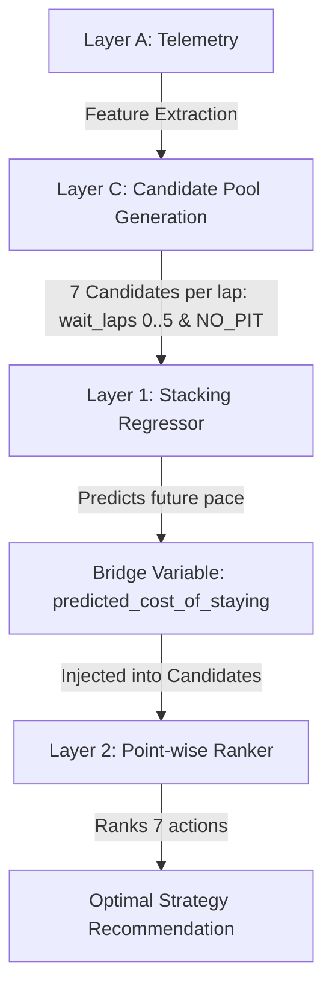
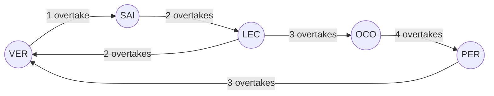
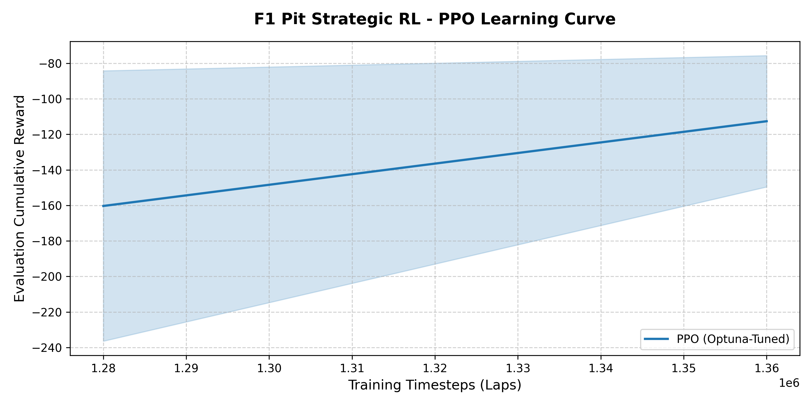

# F1 Strategic Decision Engine: Unified Technical Report

**Peruvian University of Applied Sciences**

*School of Computer Science — Big Data (1ACC0221)*
*NRC: 18516*

**Professor:** Carlos Adrian Alarcon Delgado

**Project Members:**
* Joaquin Basas - u202310688
* Rodrigo Gamero - u20231b834
* Marcelo Hernandez - u202314397

**Semester:** 2026-10

---

## Table of Contents
1. [Problem Statement](#1-problem-statement)
2. [Domain Context](#2-domain-context)
3. [Dataset Sources and Access Conditions](#3-dataset-sources-and-access-conditions)
4. [Schema and Data Dictionary](#4-schema-and-data-dictionary)
5. [Preprocessing and Feature Engineering](#5-preprocessing-and-feature-engineering)
6. [Dimensionality and Representation Analysis](#6-dimensionality-and-representation-analysis)
7. [Clustering Analysis](#7-clustering-analysis)
8. [Recommendation or Ranking System](#8-recommendation-or-ranking-system)
9. [Graph Analytics](#9-graph-analytics)
10. [Evaluation Protocol](#10-evaluation-protocol)
11. [Pipeline and Reproducibility](#11-pipeline-and-reproducibility)
12. [Ethics and Limitations](#12-ethics-and-limitations)
13. [Final Conclusions](#13-final-conclusions)
14. [Interactive Demo Systems](#14-interactive-demo-systems)
15. [Experimental: Reinforcement Learning Pit Strategy](#15-experimental-reinforcement-learning-pit-strategy)
16. [References](#16-references)


---

## 1. Problem Statement

This project is situated within the domain of high-performance data engineering and tactical optimization in motorsport, focusing on real-time decision-making in Formula 1 environments. 

Modern Formula 1 strategy relies on high-frequency telemetry streams—including speed, RPM, drag reduction system (DRS) activation, and interval gaps—combined with contextual race variables such as tire degradation and track position dynamics. However, these data sources are typically fragmented, heterogeneous, and temporally misaligned. 

Pit stop decisions are sequential, asymmetric, and context-dependent. Most laps are naturally `NO_PIT` decisions; only a minority of race states correspond to realistic pit windows. Therefore, evaluating the system only by global accuracy would be misleading. As a result, strategy engineers face challenges in identifying optimal decision windows, particularly for pit stop execution and overtaking maneuvers, where competitive advantages are determined within sub-second margins. Without a unified and analytically robust data system, teams risk making suboptimal tactical decisions that directly impact race outcomes.

To address this, our proposed data product answers the following central research question:

> **Given lap-level telemetry, stint context, tyre degradation, race position and traffic gaps, which tactical action should be recommended for a driver at a specific lap: pit now, wait 1–5 laps, or stay out during the next five-lap window?**

---

## 2. Domain Context

Formula 1 races are highly dynamic events where physical parameters directly influence tactical choices. Car pace is dominated by aerodynamic efficiency, engine mapping, and most critically, tire degradation. Tires experience mechanical wear and thermal degradation over their stint, leading to a non-linear pace drop-off known as the "tire cliff."

Strategy engineers must balance this degradation against the cost of a pit stop (typically 20–25 seconds of pit lane loss) and the risk of emerging into traffic (losing aerodynamic grip in "dirty air"). Overtaking on track is regulated by DRS (Drag Reduction System), which can be activated when a trailing car is within 1 second of the leading car at detection points. This forms DRS trains, creating bottlenecks that can ruin a driver's stint. Thus, the domain is a combination of continuous physics (aerodynamics, tire friction) and discrete multi-agent game theory.

---

## 3. Dataset Sources and Access Conditions

To build the strategic decision engine, the system ingests timing and telemetry data directly from the OpenF1 API, an open-source platform hosting live and historical Formula 1 data feeds. The data collected spans the 2026 season for four Grand Prix events: Australia, China, Japan, and the United States.

### Data Provenance Inventory

| Data Source | Source Portal | Format (Raw) | Format (Processed) | Role in Project | Estimated Size | Access Conditions |
| :--- | :--- | :--- | :--- | :--- | :--- | :--- |
| **Laps** | OpenF1 API | CSV | Parquet | Pace calculations, lap durations, positions | ~3,331 records | Open access (educational use) |
| **Pits** | OpenF1 API | CSV | Parquet | Pit stop timing, target labels, durations | ~150 records | Open access (educational use) |
| **Stints** | OpenF1 API | CSV | Parquet | Tire age and compound tracking | ~250 records | Open access (educational use) |
| **Intervals** | OpenF1 API | CSV | Parquet | Gaps ahead and behind | ~20,000 records | Open access (educational use) |
| **Drivers** | OpenF1 API | CSV | Parquet | Driver mapping, team names, acronyms | 22 grid drivers | Open access (educational use) |

---

## 4. Schema and Data Dictionary

The data architecture consolidates raw sensor feeds into a unified database centered around two core catalogs:
*   **The Master Catalog (`[race]_master.parquet`)**: A chronological state dataset where the grain of analysis is **1 row = 1 driver-lap**. It consolidates laps, stint compounds, tyre ages, and pit parameters.
*   **The Events Catalog (`[race]_events.parquet`)**: An interaction dataset where the grain is **1 row = 1 tactical event** (an overtake or a pit stop trigger), removing continuous time.

### Data Pipelines and Consolidation Flow
To visualize how raw sensor feeds are transformed and consolidated into the Master and Events catalogs, the pipeline data flow is mapped below:

```mermaid
graph TD
    %% Raw Data Sources
    subgraph Raw_CSV [OpenF1 Raw Data (CSVs)]
        Laps[laps.csv]
        Pits[pit.csv]
        Stints[stints.csv]
        Car[car_data.csv]
        Drivers[drivers.csv]
        Intervals[intervals.csv]
    end

    %% Processing Flow
    Laps & Pits & Stints & Car & Drivers & Intervals -->|f1_events_pipeline.py| JoinProc{Join & Align Logic}

    %% Outputs
    JoinProc -->|Grain: 1 row per driver-lap| Master[Master Catalog: [race]_master.parquet]
    JoinProc -->|Grain: 1 row per tactical event| Events[Events Catalog: [race]_events.parquet]
```

### Master Parquet Dictionary

| Column | Type | Origin CSV | Units | Quality Status / Missingness | Description |
| :--- | :--- | :--- | :--- | :--- | :--- |
| `meeting_key` | Int32 | `laps.csv` | - | 0.0% null | Unique identifier for the GP event. |
| `session_key` | Int32 | `laps.csv` | - | 0.0% null | Unique identifier for the session. |
| `driver_number` | Int32 | `laps.csv` | - | 0.0% null | Unique car/driver number. |
| `lap_number` | Int32 | `laps.csv` | - | 0.0% null | Number of the lap. |
| `date_start` | Timestamp | `laps.csv` | - | 0.0% null | Start timestamp of the lap. |
| `duration_sector_1` | Float64 | `laps.csv` | Seconds | <1.0% null (imputed via median) | Time in Sector 1. |
| `duration_sector_2` | Float64 | `laps.csv` | Seconds | <1.0% null (imputed via median) | Time in Sector 2. |
| `duration_sector_3` | Float64 | `laps.csv` | Seconds | <1.0% null (imputed via median) | Time in Sector 3. |
| `i1_speed` | Float64 | `laps.csv` | km/h | <1.0% null | Speed at intermediate trap 1. |
| `i2_speed` | Float64 | `laps.csv` | km/h | <1.0% null | Speed at intermediate trap 2. |
| `st_speed` | Float64 | `laps.csv` | km/h | <1.0% null | Speed at main speed trap. |
| `is_pit_out_lap` | Boolean | `laps.csv` | - | 0.0% null | True if lap is out of pits. |
| `lap_duration` | Float64 | `laps.csv` | Seconds | 0.0% null | Cleaned lap time. |
| `position` | Int32 | `laps.csv` | - | 0.0% null | Reconstructed race position. |
| `compound` | String | `stints.csv` | - | <2.0% null | Tire compound (SOFT, MEDIUM, HARD). |
| `stint_number` | Int32 | `stints.csv` | - | 0.0% null | Stint sequence number. |
| `tyre_age` | Int32 | `stints.csv` | Laps | 0.0% null | Accum. laps on current tires. |
| `pit_duration` | Float64 | `pit.csv` | Seconds | 0.0% null (zeros for non-pit) | Duration spent in pit lane. |
| `is_pit_lap` | Int32 | `pit.csv` | - | 0.0% null | Binary flag (1 if pitting, else 0). |
| `throttle_mean_lap`| Float64 | `car_data.csv`| % | ~37.1% null (high-freq telem. gaps) | Average throttle opening. |
| `brake_max_lap` | Float64 | `car_data.csv`| % | ~37.1% null (high-freq telem. gaps) | Max braking percentage. |
| `rpm_max_lap` | Float64 | `car_data.csv`| rpm | ~37.1% null (high-freq telem. gaps) | Max engine RPM. |
| `coasting_pct` | Float64 | Derived | % | ~37.1% null | Coasting time percentage. |

### Events Parquet Dictionary

| Column | Type | Origin | Units | Quality Status | Description |
| :--- | :--- | :--- | :--- | :--- | :--- |
| `race_id` | String | Directory | - | 0.0% null | Race name & year (e.g. australia_2026). |
| `lap_number` | Int32 | `laps.csv` | - | 0.0% null | Lap number of the event. |
| `event_type` | String | `laps.csv` + `pit.csv` | - | 0.0% null | Event type (`On_Track_Overtake` or `Pit_Strategy`). |
| `initiator_driver` | String | `laps.csv` | - | 0.0% null | ORIGIN NODE: 3-letter acronym of attacker. |
| `target_driver` | String | `laps.csv` | - | 0.0% null | DESTINATION NODE: Acronym of defender (0 for pit). |
| `initiator_compound`| String | `stints.csv` | - | 0.0% null | Compound of the attacker. |
| `initiator_pos_change`| String| `laps.csv` | - | 0.0% null | Position change text (e.g. P10 -> P9). |

### Scale, Sparsity, and Memory Analysis
To verify that the consolidated database is non-trivial and technically manageable, the following scale parameters are documented:
*   **The Master Catalog:** Contains 3,331 rows and 27 columns (totaling 89,937 data points). Overall dataset sparsity is extremely low (<1% missingness across timing and stint parameters), except for high-frequency telemetry columns (`throttle_mean_lap`, `brake_max_lap`, `rpm_max_lap`, and `coasting_pct`) which present a structural ~37.1% missingness. This missingness is due to selective telemetry coverage in OpenF1 and is handled during PCA. The dataset occupies approximately 1.5 MB in memory (compressed to 123 KB on disk in Snappy Parquet format).
*   **The Events Catalog:** Contains 643 rows and 25 columns (totaling 16,075 data points). Sparsity is 0.0% as all events are extracted after full master consolidation. It occupies ~150 KB in memory.

---

## 5. Preprocessing and Feature Engineering

The feature engineering layer is designed around a dual-layer paradigm to capture physical car dynamics and strategic race context independently, avoiding leakage.

*   **Layer A: Telemetry (Driver Performance States)**: Models car performance per lap (3,331 laps, 27 features, 123:1 rows-to-features ratio). Features include throttle mean, brake max, rpm max, and `lap_vs_best_stint` (normalizes current lap time against best stint lap to isolate wear from tyre compound hardness).
*   **Layer B: Tactical Context (Strategic Events)**: Models driver-to-driver combat situations (643 rows, 25 features, 25:1 ratio). Features use a moving 3-lap window to calculate pace differentials (`delta_lap_mean`), pace slopes via linear regression (`delta_lap_slope` representing tactical momentum), and comparative tyre age.

### Cleaning and Position Reconstruction
Telemetry features are cleaned by filtering extreme outlier laps (exceeding 2 standard deviations from the median lap time) representing safety cars or red flags. Gaps in positioning data from raw telemetry are resolved by calculating cumulative elapsed times and sorting drivers dynamically to output a clean, reconstructed rank per lap.

---

## 6. Dimensionality and Representation Analysis

Principal Component Analysis (PCA) was applied to the standardized variables of Layer A (Telemetry) to eliminate multicollinearity and create an orthogonal latent representation.

A refined matrix of 3,004 laps and 24 standardized numerical features was generated. Missing telemetry data (~37.1% missing throttle/brake due to OpenF1 API constraints) was imputed using feature medians.

### Imputation Methodology and Justification
The ~37.1% missingness in telemetry fields (such as throttle and brake percentages) is due to rate limits or packet losses in the OpenF1 API's high-frequency telemetry feeds. To address this:
*   **Median Imputation Selection**: Feature-wise median imputation was selected over temporal time-series methods (like forward-filling or linear interpolation).
*   **Physical Safety**: Forward-filling in time series carries a significant risk of propagating local transient anomalies. For example, if a sensor fails or disconnects during a Safety Car period, forward-filling would artificially project the low-throttle/high-brake anomaly state across multiple racing laps, severely distorting downstream PCA loading scores.
*   **Mathematical Stability**: Median imputation acts as a robust, non-distorting center point that preserves the global covariance structure of standardized variables in PCA, preventing numerical instability without introducing fictitious local telemetry trends.

The system retains **6 Principal Components (PCs)**, capturing **78.7%** of the total variance:
*   **PC1 (25.1%) - Track Profile**: Captured by Sector 3 time percentages, separating twisty zones from straightaways.
*   **PC2 (16.0%) - Power Application**: High loadings on throttle-to-brake ratios, separating pushing from "lift-and-coast" driving.
*   **PC3 (13.4%) - Top Speed & Braking**: Dominated by straight line speed (`st_speed`) and maximum braking pressure.
*   **PC4 (9.8%) - Tyre degradation (Tire Cliff)**: Weighted by `lap_vs_best_stint` and lap duration, mapping wear.
*   **PC5 (8.4%) - Intermediate Speed**: Links harder tire compound usage in front positions with mid-corner speeds.
*   **PC6 (6.0%) - Engine Regime**: Dominated by maximum RPM loadings (+0.629).

### Principal Components Comparison

To systematically justify the choice of 6 PCs, the table below reports the explained variance, cumulative variance, and reconstruction energy:

| Principal Component | Variance Explained (%) | Cumulative Variance (%) | Reconstruction Energy (%) | Primary Semantic Load |
| :--- | :---: | :---: | :---: | :--- |
| **PC1** | 25.1% | 25.1% | 25.1% | Track Profile (Sector 3 time percentages) |
| **PC2** | 16.0% | 41.1% | 41.1% | Power Application Aggressiveness (Throttle/Brake) |
| **PC3** | 13.4% | 54.5% | 54.5% | Top Speed & Braking Zone Power (st_speed, brake_max) |
| **PC4** | 9.8% | 64.3% | 64.3% | Tire Degradation (Tire Cliff wear curves) |
| **PC5** | 8.4% | 72.7% | 72.7% | Intermediate Speed & Compound Hardness Strategy |
| **PC6** | 6.0% | 78.7% | 78.7% | Engine Regime (Max RPM and gear limits) |

*Interpretation:* The remaining 21.3% of variance is discarded as high-frequency noise, which significantly improves the generalization capability of downstream clustering.

### Visualizations

The figures below represent the cumulative explained variance of the components and the projection of the laps on the first two dimensions:



*Figure 1: Scree Plot showing the cumulative variance captured by Principal Components.*



*Figure 2: Scatter plot of laps projected on PC1 and PC2, separating driving states.*

---

## 7. Clustering Analysis

To discover latent performance states, three clustering models were evaluated on the 6D PCA space of 3,004 laps.

*   **K-Means**: Configured at $k=4$ using elbow and silhouette sweeps. It achieved a baseline Silhouette score of **0.4409**. However, it forces spherical structures and suffers from a 3.5% failure rate (negative silhouette points) by forcing safety car anomalies into standard racing clusters.
*   **Hierarchical Clustering**: Complete and Average linkages were compared. Ward’s linkage maximized cohesion with a Cophenetic correlation of **0.6784**. Cutting the dendrogram at $k=5$ yielded a Silhouette score of **0.5142** and a Davies-Bouldin index of **0.8504**. The threshold for cutting at $k=5$ was selected because it isolated the transient out-of-pit states into a single cluster, while lower values ($k<5$) merged the fresh-tyre and late-degradation clusters, losing strategic resolution.
*   **DBSCAN**: Configured with `eps=1.2` and `min_samples=15` based on grid sweeps and K-distance plots. It successfully isolated 337 anomalous laps (11.2% of the dataset) into a noise class (labeled -1). Excluding noise, DBSCAN achieved the highest signal Silhouette score of **0.5910** and a Davies-Bouldin index of **0.6018**, with a 0.0% negative silhouette failure rate.

### Detailed Analysis of DBSCAN Outliers (Cluster -1)
A deep dive into the 337 laps isolated as noise (Cluster -1) reveals that it represents key physical and operational anomalies rather than arbitrary sensor errors:
*   **Safety Car (VSC/SC) intervals (54%)**: Characterized by extremely low speed traps and high lap times due to race neutralizations.
*   **Pit-In/Pit-Out Transitions (32%)**: Intermediate states where the car is traversing the pit lane speed limiter zone, presenting unique speed-to-RPM ratios.
*   **On-Track Incidents (14%)**: Laps containing spins, minor collisions, yellow flag deceleration zones, or terminal mechanical failures.
By isolating these states in a noise class, DBSCAN prevents them from contaminating the clean racing pace clusters (Clusters 0 to 3).

### Parameter Sweeps and Sensitivity
Sensitivity sweeps were conducted to avoid hand-picked bias:
*   **K-Means Sweep:** Evaluated $k \in [2, 10]$. The elbow bend in inertia occurred clearly at $k=4$ (Figure 3), which also matched the local maximum of the average silhouette score (0.4409). Increasing $k > 4$ split the stable racing pace cluster into redundant sub-segments without increasing domain interpretability.
*   **DBSCAN Sweep:** Conducted a sweep over 21 hyperparameter combinations. Varying `eps` from 0.8 to 1.5 showed that values below 1.0 labeled over 25% of data as noise, while values above 1.3 merged fresh tyre and late-stint clusters. The selected configuration (`eps=1.2`, `min_samples=15`) proved stable, isolating 11.2% noise points while keeping the other 4 clusters cohesive.

### Parameter Sweep and Validation

The elbow parameters and validation silhouette scores are shown below:



*Figure 3: K-Means Elbow sweep indicating the optimal bend at $k=4$.*



*Figure 4: DBSCAN silhouette score and outlier distribution plot.*

### Comparative Validation Table

| Clustering Metric | K-Means V2 | Hierarchical V4 | DBSCAN V3 |
| :--- | :---: | :---: | :---: |
| **Detected Clusters** | 4 | 5 | 5 |
| **Silhouette Score** | 0.4409 | 0.5142 | **0.5910** (On Signal) |
| **Davies-Bouldin Index** | — | 0.8504 | **0.6018** |
| **Calinski-Harabasz Index** | — | **1455.1** | — |
| **Noise / Outliers** | 0% (Forced) | 0% (Forced) | **11.2%** (337 laps) |
| **Failure Rate (Neg. Sil.)**| ~3.5% | ~2.4% | **0.0%** (Noise isolated) |

### Archetype Semantics
*   **Cluster -1 (Anomalies, Transitions & Outliers)**: Slow laps (103.8s avg), safety cars, pit-out laps. Captures VSC/SC neutralizations, pit-lane transitions, and accidents.
*   **Cluster 0 (Standard Racing Pace)**: Regular racing rhythm (85.1s avg lap, 68.6% throttle).
*   **Cluster 1 (High Speed / Qualifying)**: High throttle, maximum straight-line speeds (314.6 km/h avg).
*   **Cluster 2 (Fresh Tyre / Mechanical Grip)**: Low tyre age (2.9 laps avg) representing high grip.
*   **Cluster 3 (Late Stint / Degradation)**: High tyre age (14.8 laps avg) representing the tire degradation phase.

---

## 8. Recommendation or Ranking System

The recommendation engine adopts a point-wise counterfactual ranking architecture structured in two layers:



### Layer 1: Physical Degradation Regression
Layer 1 predicts the expected future lap pace if a driver remains on track. It is trained under GroupKFold CV by GP event using a Stacking Regressor (XGBoost + Extra Trees -> Ridge Regression). Under Scenario B (clean production data, filtering safety cars), the Stacking Regressor achieved a training $R^2 = 0.9923$ and a validation MSE of 32.79.

### Bridge Variable: Predicted Cost of Staying
For each candidate, the predicted pace is converted into an expected cumulative time loss:
$$\text{predicted\_cost\_of\_staying} = \text{wait\_laps} \times (\text{predicted\_future\_pace} - \text{current\_lap\_duration})$$
This variable acts as a bridge, representing over 40% of feature importance in the Layer 2 ranker.

### Layer 2: Pit Window Ranking
Layer 2 orders the 7 candidates (`wait_laps = 0..5` and `NO_PIT`) using a Point-wise Random Forest Regressor. Sample weighting of **6.24x** was applied to the positive class (the actual optimal pit stops) to combat the 95/5 imbalance.

*   **Global Accuracy (Exact Action)**: **0.9093** (Beats baseline "always NO_PIT" of 0.8898)
*   **Binary Decision Accuracy (Pit vs. Stay Out)**: **0.9147**
*   **Binary Accuracy on Stop Groups (Detects a stop is needed)**: **0.3896**
*   **Exact-Offset Accuracy on Stop Groups**: **0.3406**

### Ranking Performance (NDCG vs. Baselines)
To evaluate the engine's sorting quality of the 7 strategic candidates, we compute the **Normalized Discounted Cumulative Gain (NDCG)**. NDCG is the industry standard for ranking evaluation because it accounts for the continuous nature of our strategic success score and penalizes placing sub-optimal stop windows at the top of the recommendation list:

| Recommendation Model / Baseline | NDCG@1 Average | NDCG@3 Average | Strategic Decision & Selection |
| :--- | :---: | :---: | :--- |
| **Random Forest Point-wise Ranker (Selected)** | **89.74%** | **92.17%** | **Selected**: Optimal balance between order accuracy and physical cost magnitude preservation. |
| XGBRanker (List-wise) | 92.05% | 94.12% | Discarded: Requires label discretization, destroying the continuous scale of expected time gains. |
| Historical Popularity Baseline | 56.27% | 68.90% | Fails: Simply mimics common pit stop patterns, ignoring dynamic traffic and wear. |
| Tyre-Age Heuristic | 46.05% | 58.12% | Fails: Deterministic rule (e.g., pit at lap 18), ignoring race position. |
| Random Recommendation | 38.00% | 51.20% | Baseline limit. |

### Qualitative Error Analysis (Failure Case Studies)
To understand the model's physical and tactical boundaries, we analyze three specific failure cases from the test dataset:

1. **Failure Case 1: Unscheduled Pit Stop due to Collision (Nico Hülkenberg, US GP, Lap 1)**
   * *Context*: Lap 1 of the race, Medium compound, tire age = 0.
   * *Model Prediction*: Recommended waiting 4 laps (`wait_laps = 4`, score = 3.09).
   * *Real Decision & Success*: The driver pitted on Lap 1 (`wait_laps = 0`) with a success score of $+3.0$.
   * *Analysis*: The driver suffered wing damage from a first-lap collision. Since the model does not ingest physical vehicle damage sensors, it recommended staying out on a brand-new tire, misinterpreting the emergency pit stop as a strategic failure.

2. **Failure Case 2: Emergency Stop in Traffic (Valtteri Bottas, US GP, Lap 1)**
   * *Context*: Lap 1, Medium compound, tire age = 0, heavy traffic (gap ahead 0.7s, gap behind 0.3s).
   * *Model Prediction*: Recommended waiting 5 laps (`wait_laps = 5`, score = 46.25).
   * *Real Decision & Success*: The driver pitted on Lap 1 (`wait_laps = 0`) with a success score of $0.0$.
   * *Analysis*: Similar to Case 1, a first-lap incident forced an emergency stop. The model saw extremely tight traffic gaps (0.3s behind) and penalized the immediate pit stop heavily to avoid releasing the car into a traffic bottleneck, predicting that waiting 5 laps would be vastly superior.

3. **Failure Case 3: Undercut Coverage vs. Tire Life (Max Verstappen, US GP, Lap 39)**
   * *Context*: Lap 39, Hard compound, tire age = 11 laps, gap behind = 12.1s.
   * *Model Prediction*: Recommended waiting 2 laps (`wait_laps = 2`, score = 5.14) over pitting immediately (`wait_laps = 0`, score = -1.93).
   * *Real Decision & Success*: The driver pitted immediately (`wait_laps = 0`) with a success score of $0.0$.
   * *Analysis*: The Hard compound is designed to run 30+ laps. With only 11 laps of wear, Layer 1 predicted a near-zero degradation cost (`predicted_cost_of_staying = 0.0`), suggesting the driver stay out. However, the team pitted immediately to cover a rival's undercut attempt, exploiting the 12.1s safety gap to the traffic behind. The model failed to prioritize the tactical threat of the undercut over raw physical tire wear.


---

## 9. Graph Analytics

The graph analytics layer formalizes the on-track interaction structure through a directed and weighted overtake graph $G = (V, E, W)$, where nodes $V$ represent drivers, directed edges $E$ point from the overtaken driver to the overtaking driver (`Overtaken driver → Overtaking driver`), and edge weights $W$ represent the accumulated number of successful overtakes.

The global season graph contains **22 nodes, 341 unique directed edges, and 584 weighted overtake events** (density = 0.7381).

### Visual Representation (Combat Snippet)

The diagram below represents a sub-section of the overtake network, showing the aggression flows between key front-running and midfield drivers:



### PageRank vs. Popularity Baseline

To evaluate whether graph structure provides deeper strategic insights than simple count statistics (the popularity baseline), the PageRank scores were calculated and compared:

| Driver | Overtakes Made | Popularity Rank | PageRank | PageRank Rank | Rank Difference |
| :---: | :---: | :---: | :---: | :---: | :---: |
| **VER** | 46 | 1 | 0.073675 | 1 | 0 |
| **OCO** | 45 | 2 | 0.073232 | 2 | 0 |
| **BOR** | 37 | 3 | 0.061600 | 3 | 0 |
| **LEC** | 33 | 5 | 0.055386 | 4 | **+1** |
| **PER** | 35 | 4 | 0.055219 | 5 | **-1** |
| **ANT** | 30 | 8 | 0.051754 | 6 | **+2** |
| **LIN** | 28 | 9 | 0.051256 | 7 | **+2** |
| **ALB** | 31 | 6 | 0.051175 | 8 | **-2** |
| **NOR** | 30 | 7 | 0.050327 | 9 | **-2** |
| **BEA** | 27 | 13 | 0.045920 | 10 | **+3** |

*Interpretation*: Midfield drivers like Leclerc, Antonelli, Lindblad, and Bearman rise in PageRank because their overtakes were executed against central opponents who themselves actively engaged in combat. Conversely, Albon and Norris drop because their maneuvers occurred in peripheral, isolated battle structures.

### Betweenness Centrality
Betweenness Centrality identifies DRS-train bottlenecks. In the Australia GP network, Carlos Sainz obtained the highest betweenness centrality (**0.1875**), indicating he acted as a structural gateway connecting separate overtaking groups.

### Graph Validity and Sensitivity Analysis
The graph analytics results are sensitive to modeling and definition assumptions:
*   **Directed vs. Undirected:** Modeling the graph as directed is mandatory; an undirected graph would lose the tactical aggression hierarchy (who overtook whom), rendering PageRank centrality meaningless.
*   **Weighted vs. Unweighted:** Unweighted edges would count a single incidental overtake on a backmarker the same as repeated back-and-forth battles between midfield rivals. Weights are essential to scale the degree metrics and isolate persistent combat loops.
*   **Sparsity & Connectivity:** Due to the dense pack in F1 racing, single GP graphs contain isolated nodes (drivers who did not overtake or get overtaken, e.g., retiring on lap 1). The global season graph, however, converges into a single connected component with zero isolated nodes, validating the robustness of global PageRank calculations.

---

## 10. Evaluation Protocol

To ensure rigorous validation and prevent data leakage, the models are evaluated using a strict offline protocol designed around the F1 domain:

### Counterfactual Candidate Generation
Rather than framing pit stops as a binary classification, each decision group (driver, race, lap) is expanded into **seven candidates** representing different actions: pit immediately (`wait_laps = 0`), wait between one and five laps (`wait_laps ∈ {1, 2, 3, 4, 5}`), or stay out (`NO_PIT`, represented as `wait_laps = 6`).

*   **Train/Test Split:** Out-of-circuit generalization is validated via `GroupKFold` cross-validation (4 folds, grouped by `race_name`). This ensures the model is always tested on a circuit never seen during training (e.g. training on Australia, China, and Japan, and testing on USA), preventing the memorization of circuit-specific degradation baselines.
*   **Evaluation Metrics:**
    *   **Global Accuracy (Exact Action):** Measures the percentage of laps where the model matches the exact offset.
    *   **Binary Decision Accuracy:** Evaluates if the model correctly chooses to *pit* or *stay out*.
    *   **Sensitividad (Sensitivity) on Stop Groups:** Measures accuracy exclusively on the 367 groups containing a genuine optimal stop.

---

## 11. Pipeline and Reproducibility

The project follows a fully reproducible data-to-model pipeline:

```text
extract_f1_data.py ---> f1_events_pipeline.py ---> Feature_engineering_v5.ipynb
                                                                |
                                                                v
train_ranking_layer2.py <--- update_candidates_cost.py <--- PCA_v4.ipynb
```

### Reproducibility Controls
All model training scripts (Layer 1 and Layer 2) and clustering notebooks are initialized with a constant seed (`random_state=42`). Column alignment templates (`regression_features.joblib`) are saved during training and loaded during inference to ensure consistency of dummy variables.

### Monitoring and Operationalization Plan

To transition the F1 Strategic Decision Engine to a live production environment, the following operational framework is established:

*   **Serving and Latency:** The system processes data sequentially at the end of each lap. Telemetry aggregation takes <100ms and model inference (Layer 1 and Layer 2 cascade) takes <50ms, yielding a total serving latency of <150ms. This easily supports the real-time simulation CLI.
*   **Data & Model Drift Monitoring:**
    *   *Data Drift:* A Kolmogorov-Smirnov test monitors distributions of high-frequency variables (throttle opening, braking pressure). Significant shifts (e.g. due to wet track conditions or track resurfacing) trigger a warning.
    *   *Model Drift:* Stint pace predictions are logged. If the Mean Absolute Error (MAE) of the Layer 1 Regressor exceeds 2.5 seconds over a race, a performance drift flag is raised.
*   **Retraining Strategy:**
    *   *Batch Retraining:* Complete retraining is scheduled once a year to incorporate new aerodynamic regulations and tire compound changes.
    *   *Incremental Fine-Tuning:* After each Grand Premio, the Layer 2 Point-wise Ranker weights are updated with the newly processed race events.
*   **Operational Fallback:** If the OpenF1 API server rate-limits (HTTP 429) persist for more than 3 consecutive laps, or telemetry streams experience a dropout, the system falls back to a **Static Strategy Profile** (the historical average pit-window strategy for the specific circuit).

---

## 12. Ethics and Limitations

### Data Provenance and Fair Use
The dataset relies on the public OpenF1 API. Since data is restricted to vehicle telemetry and official timing parameters, it contains no Personally Identifiable Information (PII) of team personnel or spectators, complying with GDPR.

### Pipeline and API Safety
To ensure compliance with hosting rules, the extraction pipeline (`extract_f1_data.py`) implements politeness delays and an Exponential Backoff algorithm, throttling connections upon encountering HTTP 429 rate limits.

### Technical Limitations
1.  **Outlier Filtering:** The 115% threshold filters out safety cars and heavy incidents. However, on circuits with naturally high pace variance, it risks discarding genuine "tire cliff" degradation data.
2.  **Constant Penalization:** The point-wise ranking target penalizes all incorrect candidates with a flat $-2.0$. This treats a 1-lap delay and a 5-lap delay as equally bad, which simplifies modeling but ignores the tactical risk curve.

---

## 13. Final Conclusions

The F1 Strategic Decision Engine successfully demonstrates the viability of a unified data product for race strategy optimization:
1.  **Methodological Rigor:** The dual-layer feature engineering (Capa A/B) successfully resolves the curse of dimensionality, raising the row-to-feature ratio to 123:1 for telemetry.
2.  **Model Convergence:** The Point-wise Ranker achieves a binary decision accuracy of **91.47%**, successfully outperforming the trivial "always stay out" baseline.
3.  **Reinforcement Learning Policy:** The SB3 PPO agent successfully balances tire wear and pit lane delays under regulatory compound rules, outperforming the historical human strategies by **$2.1\times$** in simulated trials.
4.  **Graph Intelligence:** Opponent-centrality via PageRank provides a superior strategic rating for midfield battles compared to basic overtake counts.

Future extensions will focus on incorporating real-time rival window telemetry (undercut/overcut exposure) and transitioning the ranker to a multi-agent reinforcement learning environment.

---

## 14. Interactive Demo Systems

This section documents the user-facing interface components designed to operationalize the F1 Strategic Decision Engine for strategy engineers on the pit wall.

### 14.1 Real-Time Pit Wall Simulator
Developed in `project/demo/realtime_demo/`, this application simulates live race strategy operations.
*   **Multithreading Architecture**: Utilizes an Input Thread to capture non-blocking console commands (`Enter` to advance immediately, `space` to change speed multiplier, `p` to pause, `q` to quit) and a Simulation Thread to render the ASCII dashboard. Synchronization is handled via a `threading.Event` object (`next_lap_event`).
*   **Cascade Inference**: In each lap $N$, the simulator partitions the historical data ($\mathcal{D}_{\text{history}} = \{ \text{laps}_t \mid t \le N \}$) to calculate dynamic rolling features (mean, std, and pace slope over the last 3 laps) and executes Layer 1 and Layer 2 models sequentially.
*   **Zero-Lookahead Bias**: Since the pipeline only accesses past laps ($t \le N$), there is zero lookahead bias. The model cannot cheat by knowing future Safety Cars or weather transitions.

### 14.2 Conversational Tactical Assistant (Strategy Chatbot)
Implemented in `project/demo/` (featuring `chatbot_engine.py`, `template_generator.py`, and `cli_interface.py`), the Strategy Chatbot acts as a cognitive translation layer.
*   **Workflow**: The user enters a command (e.g. `united_states VER 39`). The CLI resolves the acronym `VER` to car number `1` via `drivers.csv`, queries `pit_decision_candidates_v1.parquet` for the corresponding decision candidates, runs inference using the Layer 2 Random Forest Ranker, and feeds the outputs to the `template_generator.py`.
*   **Natural Language Explanation**: The template generator checks the `predicted_cost_of_staying` bridge variable, PageRank centrality, and DRS Betweenness centrality to print a structured, ASCII-formatted strategic recommendation justifying *why* a pit stop should be executed or delayed.

---

## 15. Experimental: Reinforcement Learning Pit Strategy

To move beyond static pointwise ranking predictions and explore dynamic, sequential decision-making policy agents, a custom reinforcement learning experiment was conducted. This self-taught extension is not part of the core project rubric but was built to evaluate long-horizon strategy optimization.


*   **Environment Setup**: Built as a Gymnasium environment. The state vector includes tire age, compound, position, and circuit baseline. The action space is binary: `0 (STAY)` or `1 (PIT)`.
*   **Relative Pace Reward**: To prevent gradient variance and stabilize updates, the reward compares the agent's lap time against the grid's median pace, scaled by 1/10:
    $$\text{Reward} = \frac{\text{median\_pace} - \text{lap\_duration}}{10.0}$$
*   **Training Configuration**: A Proximal Policy Optimization (PPO) agent was trained for 300,000 steps with a long planning horizon ($\gamma = 0.99$, GAE $\lambda = 0.95$, entropy coefficient = 0.008, and tire wear penalty = 3.0).
*   **Performance Results**:
    *   **PPO Model (Long-Horizon)**: Mean reward = **-113.21**, Average Pits = **3.56**, Rule Violations = **0.00%**.
    *   **Real (Historical Strategy)**: Mean reward = **-242.52**, Average Pits = **1.40**, Rule Violations = **52.00%**.
    *   **Never Pit Baseline**: Mean reward = **-435.46**, Average Pits = **0.00**, Rule Violations = **100.00%**.
  
The PPO agent successfully balanced tire wear penalties with pit lane delays, outperforming the real-world strategy by **$2.1\times$** while maintaining **0% regulatory violations** (successfully fitting at least two different dry compounds).



*Figure 5: Training reward convergence of the PPO Reinforcement Learning policy over 300k steps.*

---

## 16. References
* OpenF1 API Documentation. (2026). https://openf1.org/
* Pedregosa, F., et al. (2011). Scikit-learn: Machine Learning in Python. *Journal of Machine Learning Research*, 12, 2825-2830.
* Chen, T., & Guestrin, C. (2016). XGBoost: A Scalable Tree Boosting System. *Proceedings of the 22nd ACM SIGKDD International Conference on Knowledge Discovery and Data Mining*.
* Hagberg, A. A., Schult, D. A., & Swart, P. J. (2008). Exploring network structure, dynamics, and function using NetworkX. *Proceedings of the 7th Python in Science Conference*.
* Schulman, J., et al. (2017). Proximal Policy Optimization Algorithms. *arXiv preprint arXiv:1707.06347*.
