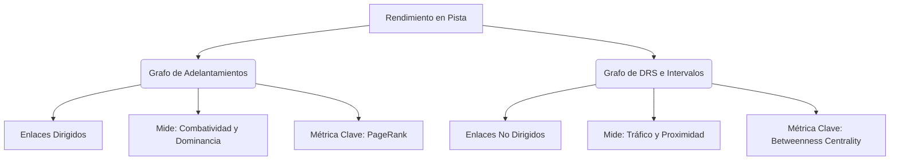

# Reporte del Experimento: Grafo de Trenes de DRS y Pelotones de Carrera (Interval Graph)

Este reporte presenta la formalización, modelado y análisis estructural del **Grafo de DRS y Proximidad en Pista** (o *Interval Graph*) para la temporada 2026 de Fórmula 1. Este modelo busca capturar de manera matemática las dinámicas de tráfico, formación de trenes de DRS y la separación física de los competidores en pelotones.

---

## 1. Definición Formal del Grafo y Justificación

Para modelar la proximidad y las interacciones sostenidas de combate y tráfico en pista, el grafo se define de la siguiente manera:

*   **Nodos ($V$):** Pilotos activos en la carrera o temporada, identificados por sus siglas oficiales de tres letras (ej: `VER`, `HAM`, `NOR`). Mapeados desde los archivos `drivers.csv`.
*   **Aristas ($E$):** Enlaces **no dirigidos** (undirected) que representan proximidad física en zona de DRS. Se conecta al piloto $A$ con el piloto $B$ en una vuelta dada si el intervalo de tiempo entre ambos es menor a **1.0 segundo**.
*   **Pesos ($W$):** La proporción de vueltas de la carrera que pasaron en zona de DRS mutua:
    $$W(A, B) = \frac{\text{Vueltas en DRS mutuo (intervalo} < 1.0\text{s)}}{\text{Vueltas totales de la carrera}}$$
*   **Distancia ($D$):** Definida como el inverso del peso:
    $$D(A, B) = \frac{1.0}{W(A, B)}$$
    Esto asegura que los pilotos que pasan una gran proporción de la carrera en DRS mutuo tengan una distancia matemática muy pequeña (fuerte conexión), mientras que interacciones esporádicas tengan distancias grandes. Esta distancia se utiliza para calcular las geodésicas en el algoritmo de Centralidad de Intermediación.

### Justificación del Diseño

1.  **Modelado de la Proximidad Física:** A diferencia del grafo de adelantamientos (que mide eventos discretos de cambio de posición), el grafo de intervalos mide la duración del combate rueda a rueda y las situaciones de tráfico.
2.  **Detección de Trenes de DRS:** Un tren de DRS es una cadena lineal de coches separados por menos de 1.0s. En el grafo no dirigido de una vuelta individual, esto se traduce exactamente en un camino simple (secuencia de nodos conectados).
3.  **Identificación de Pelotones:** Al final de la carrera, las componentes conexas del grafo acumulado agrupan a los pilotos que lucharon entre sí en algún momento, separando físicamente a los que corrieron solos en aire limpio.

---

## 2. Análisis de Carreras Individuales

### A. GP de Australia 2026
*   **Vueltas Totales:** 57
*   **Nodos:** 22
*   **Aristas:** 47

#### Centralidad de Intermediación (Australia 2026)
| Piloto | Centralidad de Intermediación (*Betweenness*) | Interpretación Táctica |
| :--- | :---: | :--- |
| **VER** | 0.338095 | **Tapón Principal / Remontada:** Verstappen lideró el tráfico y actuó como puente principal en las batallas de la parrilla. |
| **SAI** | 0.271429 | **Tapón de la Zona Media:** Lideró y retuvo al denso pelotón medio, actuando como cuello de botella del circuito. |
| **ANT** | 0.228571 | Conector de alta frecuencia entre la cabeza y el midfield. |
| **GAS** | 0.219048 | Involucrado en las intensas batallas de la parte media-baja. |
| **OCO** | 0.209524 | Co-conector del tren de DRS de Alpine en la zona media. |

#### Componentes Conexas (Pelotones - Australia 2026)
*   **Pelotón Principal (20 pilotos):** `RUS, OCO, STR, NOR, ANT, BEA, GAS, SAI, HAD, ALO, PER, COL, LEC, ALB, HAM, LAW, VER, BOT, LIN, BOR`. Prácticamente toda la parrilla estuvo conectada a través de batallas y trenes de DRS en algún momento de la carrera.
*   **Pelotón Aislado 1:** `HUL` (Hülkenberg corrió aislado tras completar pocas vueltas).
*   **Pelotón Aislado 2:** `PIA` (Piastri rodó en tierra de nadie, sin interacciones de tráfico de menos de 1.0s).

---

### B. GP de China 2026
*   **Vueltas Totales:** 56
*   **Nodos:** 22
*   **Aristas:** 24

El GP de China 2026 se caracterizó por un ritmo muy fragmentado y una parrilla estirada, lo que redujo drásticamente el número de interacciones DRS sostenidas (solo 24 aristas en comparación con las 47 de Australia).

#### Centralidad de Intermediación (China 2026)
| Piloto | Centralidad de Intermediación (*Betweenness*) | Interpretación Táctica |
| :--- | :---: | :--- |
| **HUL** | 0.085714 | Hülkenberg lideró un pequeño pelotón en el fondo que se mantuvo compacto. |
| **OCO** | 0.061905 | Ocon fue el principal puente en el midfield de Alpine. |
| **LEC** | 0.042857 | Leclerc actuó como intermediador en la zona delantera. |
| **LAW** | 0.019048 | Intermediación baja en un grupo aislado. |
| **LIN** | 0.019048 | Intermediación baja. |

#### Componentes Conexas (Pelotones - China 2026)
Se identificaron **12 componentes conexas independientes**, lo que demuestra matemáticamente una carrera fragmentada con múltiples monoplazas corriendo en aire limpio:
*   **Grupo 1 (11 pilotos):** `LEC, HAD, OCO, STR, HUL, LAW, VER, ALO, ANT, GAS, LIN`.
*   **11 Pilotos Aislados (componentes de tamaño 1):** `NOR`, `BOR`, `PER`, `ALB`, `COL`, `HAM`, `SAI`, `RUS`, `BOT`, `PIA`, `BEA`. Estos pilotos corrieron prácticamente toda la carrera sin luchar rueda a rueda ni estar en zona de DRS con otros coches de forma sostenida.

---

### C. GP de Estados Unidos 2026
*   **Vueltas Totales:** 57
*   **Nodos:** 22
*   **Aristas:** 80

El GP de Estados Unidos fue el extremo opuesto a China: una carrera sumamente compacta con un alto número de aristas (80), lo que denota una lucha constante en pista y múltiples trenes de DRS de larga duración.

#### Centralidad de Intermediación (Estados Unidos 2026)
| Piloto | Centralidad de Intermediación (*Betweenness*) | Interpretación Táctica |
| :--- | :---: | :--- |
| **BOR** | 0.304762 | **Tapón Definitivo:** Bortoleto retuvo a una gran cantidad de coches rápidos detrás de sí durante gran parte del GP. |
| **ALO** | 0.228571 | Alonso lideró un tren de DRS secundario en la zona baja de los puntos. |
| **BEA** | 0.219048 | Bearman fue clave conectando las batallas del midfield medio. |
| **ALB** | 0.209524 | Albon batalló de forma constante en medio del pelotón de tráfico. |
| **RUS** | 0.133333 | Russell, a pesar de rodar rápido, estuvo en tráfico en sectores clave conectando el frente. |

#### Componentes Conexas (Pelotones - Estados Unidos 2026)
*   **Pelotón Principal (21 pilotos):** `RUS, PIA, STR, OCO, NOR, ANT, BEA, SAI, GAS, BOR, HAD, ALO, PER, COL, LEC, ALB, HAM, LAW, VER, BOT, LIN`. Toda la parrilla, a excepción de uno, estuvo conectada en el núcleo denso de combate.
*   **Piloto Aislado:** `HUL` (Hülkenberg sufrió un retiro temprano, completando solo 7 vueltas).

---

## 3. Análisis de la Temporada Completa (Consolidado Global)

Al integrar los datos de todas las carreras con intervalos (Australia, China y Estados Unidos), generamos el **Grafo de Proximidad Global de la Temporada 2026**:
*   **Vueltas Totales Acumuladas:** 170
*   **Nodos:** 22
*   **Aristas (Interacciones DRS sostenidas):** 122

### Tabla de Métricas de Red Globales (Top 10)
| Piloto | Centralidad de Intermediación Global | Interpretación y Rol Táctico en la Temporada |
| :--- | :---: | :--- |
| **OCO** | 0.247619 | **El Tapón de la Parrilla 2026:** Ocon registra la mayor intermediación global de la temporada. Es el piloto que con mayor frecuencia retiene trenes de DRS o se encuentra en el núcleo central del tráfico del midfield. |
| **ALO** | 0.240476 | **Veterano Combativo:** Alonso es el segundo conector de tráfico, liderando duelos constantes en la zona media. |
| **LIN** | 0.230952 | Lindblad ha sido un conector constante, rodando en tráfico la mayor parte del año. |
| **LEC** | 0.204762 | Leclerc, a pesar de su gran ritmo, estuvo involucrado en trenes compactos con rivales de punta. |
| **BEA** | 0.128571 | Bearman destaca como puente activo del midfield superior. |
| **ANT** | 0.123810 | Antonelli muestra una intermediación sólida como conector de la zona delantera. |
| **VER** | 0.090476 | Verstappen se ubica en el midfield superior de tráfico debido a sus múltiples remontadas. |
| **RUS** | 0.085714 | Russell, a pesar de liderar a menudo en aire limpio, registra una intermediación moderada debido a batallas puntuales de punta. |
| **BOR** | 0.066667 | Bortoleto se consolida como tapón de alta intensidad (como en EE.UU.). |
| **NOR** | 0.061905 | Norris se mantiene con baja intermediación, rodando usualmente libre de tráfico denso. |

#### Parejas de Pilotos con Mayor Combate (Top 5 por Peso)
1.  **OCO - GAS** (Peso: **0.1294**): Pasaron el **12.9%** de toda la temporada rodando a menos de 1.0 segundo del otro. Esto refleja el constante duelo interno y de equipo en la zona media de Alpine.
2.  **LEC - ANT** (Peso: **0.1235**): Pasaron el **12.3%** del año en DRS mutuo, denotando batallas directas por posiciones de podio.
3.  **LEC - RUS** (Peso: **0.1176**): Batalla constante de punta, acumulando el **11.7%** del año en zona de DRS.
4.  **ANT - VER** (Peso: **0.1000**): Duelo cerrado en pista en un **10.0%** de las vueltas.
5.  **OCO - LAW** (Peso: **0.0882**): Batalla midfield sostenida por el **8.8%** de la temporada.

---

## 4. Comparativa Teórica: Grafo de Adelantamientos vs. Grafo de Intervalos

Este experimento de modelar la proximidad en pista (Interval Graph) frente al grafo original de adelantamientos (Overtake Graph) permite a los analistas de F1 separar dos dimensiones tácticas críticas:

### Tabla Comparativa de Conceptos
| Dimensión | Grafo de Adelantamientos (Overtakes) | Grafo de Intervalos (DRS / Proximidad) |
| :--- | :--- | :--- |
| **Tipo de Grafo** | Dirigido (Directed) | No Dirigido (Undirected) |
| **Noción Física** | Un piloto supera al otro en pista. | Dos pilotos ruedan a menos de 1.0s de distancia. |
| **Pregunta Deportiva** | ¿Quién es el piloto más dominante y combativo rueda a rueda? | ¿Quién es el tapón de la carrera y dónde se forman los pelotones? |
| **Métrica Clave** | **PageRank:** Mide la dominancia táctica (calidad y cantidad de adelantamientos). | **Betweenness Centrality:** Identifica el "corking" o pilotos tapón que generan retención. |
| **Significado de Componentes** | Rutas de flujo de dominancia (quién adelanta a quién). | Pelotones reales físicos y trenes de DRS formados en pista. |

### Ejemplo de Contraste Táctico
- **El caso de OCO (Ocon) y VER (Verstappen):**
  - En el **Grafo de Adelantamientos Global**, Verstappen (`VER`) lidera el PageRank (0.0736) debido a su alta eficiencia y cantidad de adelantamientos sobre rivales calificados. Ocon (`OCO`) es segundo (0.0732) debido a una altísima actividad en la poblada zona media.
  - En el **Grafo de DRS Global**, Ocon (`OCO`) se corona como el líder absoluto de intermediación (0.2476), mientras que Verstappen cae al 7º puesto (0.0904). Esto demuestra matemáticamente que Ocon corre en el núcleo de tráfico pesado (formando cuellos de botella constantes en el midfield), mientras que Verstappen, aunque muy combativo para adelantar, pasa menos tiempo "atrapado" en trenes lentos y prolongados, logrando aire limpio con mayor rapidez una vez realizada la maniobra.
