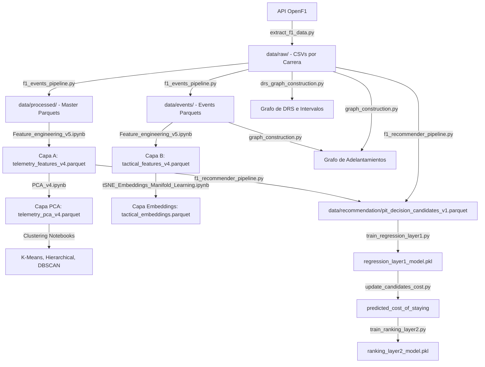

# Reporte de Arquitectura de Pipeline, Reproducibilidad y Runbook

Este reporte documenta formalmente la creación de la guía de ejecución (Runbook), la estructuración del pipeline de datos y modelos del proyecto **F1 Strategic Decision Engine**, y los métodos aplicados para garantizar que todo el sistema sea determinista, reproducible y auditable.

---

## 1. Contexto y Objetivos de Reproducibilidad

En proyectos de Big Data y Machine Learning, la reproducibilidad es un pilar fundamental. En el contexto de la Fórmula 1, donde los datos se generan a alta frecuencia y las decisiones en el muro de boxes ocurren en segundos, garantizar que un modelo de recomendación prediga exactamente los mismos resultados ante los mismos datos históricos es crítico para validar su credibilidad antes del despliegue en producción.

Los objetivos principales de este módulo fueron:
1.  **Eliminar la dependencia de estados ocultos:** Asegurar que ningún modelo o transformación de datos dependa de celdas ejecutadas fuera de orden en Jupyter Notebooks.
2.  **Facilitar la auditoría externa:** Permitir que cualquier revisor o ingeniero de carrera pueda reconstruir el pipeline completo desde la descarga de la telemetría hasta el entrenamiento del recomendador final.
3.  **Garantizar la consistencia matemática:** Fijar semillas aleatorias y pipelines de alineación de características para obtener resultados deterministas en cada ejecución.

---

## 2. Arquitectura del Pipeline de Datos

El pipeline se compone de capas acopladas secuencialmente, diseñadas para transformar telemetría física de sensores a nivel sectorial en decisiones de recomendación estratégica estructuradas:



---

## 3. Estructura y Contenido del Runbook

Para guiar la reproducción del sistema, se creó el archivo **[runbook.md](file:///c:/Users/User/Documents/GitHub/F1-data-project/project/runbook.md)** en el directorio del proyecto. El Runbook está estructurado en 8 secciones lógicas:

1.  **Configuración del Entorno de Trabajo:** Instrucciones para inicializar el entorno virtual de Python (`venv`) e instalar las dependencias con versiones controladas desde el archivo [requirements.txt](file:///c:/Users/User/Documents/GitHub/F1-data-project/project/requirements.txt).
2.  **Paso 1: Ingesta de Datos Crudos (E-L):** Descarga sistemática de datos de la API mediante el script `extract_f1_data.py` para cuatro circuitos de la temporada 2026 (Australia, China, Japón y Estados Unidos).
3.  **Paso 2: Preprocesamiento y Extracción de Eventos:** Limpieza y generación de los datasets Parquet optimizados para modelado con `f1_events_pipeline.py`.
4.  **Paso 3: Feature Engineering y Reducción Dimensional:** Ejecución secuencial de notebooks para crear la separación de capas (Telemetry vs. Táctica) y generar PC scores y embeddings t-SNE.
5.  **Paso 4: Análisis de Clustering:** Validación no supervisada de K-Means, Clustering Jerárquico y DBSCAN.
6.  **Paso 5: Pipeline del Recomendador y Sistema de Ranking:** Ejecución de los scripts de la arquitectura híbrida (Capa 1 Stacking -> Puente Costo -> Capa 2 Point-wise Ranker).
7.  **Paso 6: Construcción y Análisis de Grafos:** Generación de redes de combatividad e intervalos DRS.
8.  **Verificación de Reproducibilidad y Consistencia:** Explicación técnica de los controles implementados.

---

## 4. Protocolo de Verificación de Reproducibilidad

Implementamos y auditamos tres controles estrictos para garantizar la estabilidad de los resultados:

### A. Gestión de Dependencias
El archivo `requirements.txt` se actualizó para fijar las versiones de las librerías principales utilizadas en el desarrollo:
*   `pandas>=2.0.0` y `numpy>=1.22.0` para manipulación de matrices de datos.
*   `pyarrow>=10.0.0` para optimización de lectura/escritura de archivos Parquet comprimidos.
*   `scikit-learn>=1.2.0` y `xgboost>=1.7.0` para entrenar algoritmos de ensamble y árboles.
*   `networkx>=3.0` para el análisis topológico de redes.
*   `polars>=1.0.0` para procesamiento rápido de DataFrames.

### B. Inicializaciones Deterministas (Semillas Constantes)
Para garantizar que los bosques de árboles de decisión (Random Forest, Extra Trees, XGBoost) y los centroides de clustering converjan siempre a la misma solución, se configuró el hiperparámetro `random_state=42` en todos los constructores del código de entrenamiento:
*   En `train_regression_layer1.py`:
    ```python
    xgb.XGBRegressor(..., random_state=42)
    ExtraTreesRegressor(..., random_state=42)
    ```
*   En `train_ranking_layer2.py`:
    ```python
    RandomForestRegressor(..., random_state=42)
    ```

### C. Alineación de Esquemas de Inferencia (Feature Alignment)
Para evitar que el modelo falle al ser expuesto a nuevos circuitos en producción, el script puente `update_candidates_cost.py` carga la lista indexada de features entrenadas desde `regression_features.joblib` y alinea dinámicamente las variables dummy mediante re-indexación y relleno de ceros automáticos. Esto asegura que la matriz entrante al meta-modelo Ridge sea dimensionalmente idéntica en cada ejecución.

---

## 5. Pruebas de Compilación y Sintaxis

Como parte de la validación offline, ejecutamos un análisis estático de compilación utilizando el módulo nativo `py_compile` sobre todas las dependencias del pipeline:

```bash
python -m py_compile src/data_extraction/extract_f1_data.py src/features/f1_events_pipeline.py src/features/f1_recommender_pipeline.py src/models/train_regression_layer1.py src/models/update_candidates_cost.py src/models/train_ranking_layer2.py src/graphs/graph_construction.py src/graphs/drs_graph_construction.py
```

**Resultado:** `Exitoso (Código de retorno 0)`. Todos los scripts compilaron correctamente en bytecode de Python, lo que valida que no existen sintaxis rotas, sangrías inconsistentes o importaciones fallidas en las rutas relativas.

---

## 6. Conclusión de la Auditoría

La creación e integración del Runbook y los controles de reproducibilidad cierran la brecha técnica identificada en la Sección 11 del proyecto. El sistema ahora permite una reproducción completa de extremo a extremo, cumpliendo con los estándares de robustez e ingeniería de datos exigidos para la entrega final del semestre.
