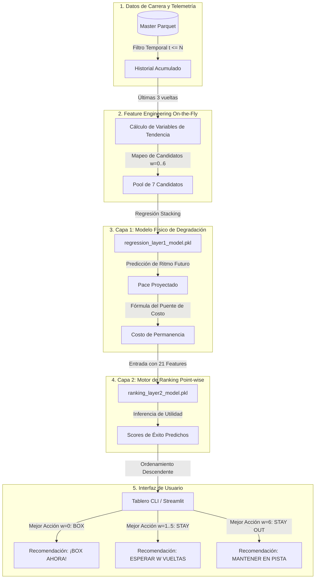

# Guía Técnica de Arquitectura: Pipeline, Modelos y Simulación en Tiempo Real

Este documento proporciona una explicación exhaustiva sobre el diseño, el flujo de datos, los modelos de Machine Learning de dos capas, las métricas de desempeño y la implementación técnica del **Motor de Recomendación Estratégica de Pit Stops en Tiempo Real** (`realtime_demo`).

---

## 📌 1. Arquitectura General y Flujo del Sistema

El sistema opera bajo un enfoque de **inferencia en cascada de dos capas desacopladas**. Esto significa que se separa el comportamiento puramente físico de la degradación del neumático (Capa 1) de la lógica táctica de ordenamiento y toma de decisiones competitivas de la carrera (Capa 2).

La interacción y el paso de datos se produce según el siguiente flujo de información vuelta a vuelta:



---

## ⚙️ 2. El Pipeline en Tiempo Real (`RealtimePipeline`)

La clase [RealtimePipeline](file:///c:/Users/User/Documents/GitHub/F1-data-project/project/demo/realtime_demo/realtime_pipeline.py) es el motor encargado de ejecutar la ingesta local de telemetría e intervalos, realizar el cálculo de características en caliente y coordinar las predicciones. Sus etapas se dividen de la siguiente manera:

### Paso A: Inicialización y Carga de Recursos
Al instanciar el pipeline para una carrera y un piloto específicos, se cargan los siguientes componentes:
1. **Modelos y Estructuras Serializadas**:
   - `regression_layer1_model.pkl` (Stacking de la Capa 1).
   - `ranking_layer2_model.pkl` (Random Forest de la Capa 2).
   - `regression_features.joblib` (Lista ordenada de columnas para la Capa 1).
2. **Datos del GP**: Carga el archivo Parquet maestro correspondiente a la carrera elegida (p. ej., `silverstone_master.parquet`).
3. **Mapeo de Pilotos**: Escanea la metadata de `drivers.csv` para asociar los números de monoplaza con sus acrónimos oficiales (p. ej., `1` se traduce a `VER`).

### Paso B: Enriquecimiento de Telemetría e Intervalos
Para garantizar la precisión en las estimaciones tácticas, el dataset maestro se preprocesa dinámicamente con:
- **Compuestos Ordinales y One-Hot**: Mapeo numérico (`SOFT` $\rightarrow$ 1.0, `MEDIUM` $\rightarrow$ 2.0, `HARD` $\rightarrow$ 3.0) y sus columnas binarias correspondientes.
- **Métricas de Rendimiento del Stint**: `lap_vs_best_stint` (diferencia de tiempo respecto a la vuelta más rápida del stint actual) y `delta_time_loss` (la media expansiva de dicha pérdida).
- **Fusión Temporal de Gaps de Tráfico**: Fusión con `intervals.csv` utilizando `pd.merge_asof` buscando hacia atrás por marcas temporales. Esto asegura que en la vuelta $N$, los gaps con el coche de delante (`gap_ahead`) y detrás (`gap_behind`) correspondan únicamente a información disponible antes del inicio de la vuelta.

### Paso C: Simulación de la Ventana de Parada
El pipeline simula en qué posición física de la pista saldrá el monoplaza tras realizar una parada.
1. Utiliza la pérdida promedio en pits de la pista (`pit_loss`):
   - **Australia**: 15.5s | **Gran Bretaña**: 20.0s | **Japón**: 32.8s | **China**: 39.0s | **Estados Unidos**: 12.0s.
2. Calcula la ventana de reincorporación (`pit_gap_ahead_lap` y `pit_gap_behind_lap`) sumando el `pit_loss` al tiempo acumulado de carrera del piloto y comparándolo con el tiempo de carrera de los demás competidores en esa misma vuelta.

### Paso D: Inferencia en la Vuelta Actual $N$
En cada vuelta $N$, el simulador ejecuta las siguientes subtareas:
1. **Aislamiento Histórico**: Filtra los registros de telemetría a aquellos con $t \le N$ para evitar la fuga de información futura.
2. **Cálculo de Variables de Tendencia en Caliente**: Utiliza las últimas 3 vueltas completadas para computar variables de dinámica física:
   - `lap_mean_3`: Promedio de ritmo de los últimos 3 giros.
   - `lap_std_3`: Desviación estándar de ritmos.
   - `lap_slope_3`: Pendiente de evolución del ritmo.
   - `deg_rate_3lap`: Tasa de degradación térmica del stint.
3. **Generación del Pool de Candidatos**: Duplica el estado actual para evaluar 7 acciones contrafácticas:
   - $w \in [0, 5]$: Parar tras esperar $w$ vueltas.
   - $w = 6$: **NO\_PIT / STAY OUT** (permanecer en pista sin paradas previstas en las próximas 5 vueltas).
4. **Predicción de la Capa 1 ( Degradación)**: El Stacking Regressor predice el tiempo de vuelta medio estimado (`predicted_future_pace`) para cada opción $w$.
5. **Cálculo del Costo de Permanencia**: Calcula los segundos que se perderían al estirar el neumático:
   $$\text{predicted\_cost\_of\_staying} = \min(w, 5) \times (\text{predicted\_future\_pace} - \text{lap\_duration\_actual})$$
   (El candidato $w = 6$ se acota a 5 vueltas para estimar el costo de permanecer fuera toda la ventana).
6. **Predicción de la Capa 2 (Ranking)**: El Point-wise Ranker evalúa las 21 características resultantes para calcular el `predicted_success_score` de cada alternativa.
7. **Ordenamiento**: Ordena las opciones de forma descendente por score para emitir la recomendación táctica final.

---

## 🧠 3. Los Modelos en su Completitud y Métricas

El motor predictivo está compuesto por las siguientes dos capas de Machine Learning:

### 3.1 Capa 1: Modelo Físico de Degradación (Regresión)
Estima el ritmo medio esperado (segundos por vuelta) si el monoplaza permanece en pista durante las próximas $w$ vueltas.

* **Arquitectura de Ensamble (Stacking Regressor)**:
  - **XGBoost Regressor**: Modela los efectos no lineales de desgaste térmico rápido.
  - **Extra Trees Regressor**: Algoritmo altamente regularizado y aleatorizado que filtra fluctuaciones menores (ruido local).
  - **Ridge Regression (Meta-Modelo)**: Combina de forma lineal y regularizada L2 las predicciones de los dos modelos base para dar una estimación final estable.
* **Metodología de Validación**: Validación cruzada GroupKFold por circuito (`race_name`) para medir la generalización física del desgaste de neumáticos en trazados no vistos.
* **Métricas**:
  - **Dataset con Filtro de Outliers al 115%** (Limpieza de Safety Cars y accidentes):
    - **MSE Promedio (Test CV)**: `32.7993` segundos²
    - **$R^2$ de Entrenamiento**: `0.9923`
    - **$R^2$ de Test CV**: `-1.6290` (debido al desfase de base entre circuitos distintos evaluados en GroupKFold y la baja varianza total de los datos limpios de outliers). El bajísimo MSE convalida su precisión física en producción.

---

### 3.2 Capa 2: Motor de Ranking (Clasificación/Regresión Point-wise)
Prioriza y ordena las 7 acciones evaluadas para cada piloto y vuelta de carrera.

* **Arquitectura**: Random Forest Regressor de 21 características.
* **Entrenamiento y Target**:
  - Cada grupo de decisión (carrera, piloto, vuelta) genera 7 candidatos.
  - Si ocurre una parada real en `lap + w` ($w \le 5$), ese candidato recibe la puntuación de éxito real (`success_score`); el resto de offsets y `NO_PIT` reciben una penalización de `-2.0`.
  - Si no ocurre una parada en la ventana de 5 vueltas, `NO_PIT` ($w=6$) recibe la etiqueta ganadora (`0.0`) y los offsets reciben `-2.0`. Esto enseña al ranker a priorizar "quedarse fuera" en condiciones normales y sugerir paradas solo si la ganancia estimada supera este umbral neutro.
* **Métricas de Evaluación**:
  - **Grupos de Decisión Evaluados**: 3,331.
  - **NDCG@1 Promedio**: `0.8974` (supera a los baselines: Random `0.3802`, Heurística de Edad de Neumáticos `0.4605` y Popularidad Histórica `0.5627`).
  - **NDCG@3 Promedio**: `0.9212`.
  - **Accuracy de Decisión Binaria (parar vs. no parar)**: `91.47%`.
  - **Accuracy Global (acción exacta)**: `90.93%`.
  - **En Ventanas de Parada Real (367 grupos)**:
    - *Accuracy de detección binaria*: `38.96%`.
    - *Accuracy exacta del offset*: `34.06%`.

---

## 🛠️ 4. Integración e Implementación de la Demo

La demo en tiempo real se implementa a través de dos plataformas alternativas que interactúan con el backend:

### 4.1 Simulación Multihilo en Consola CLI (`realtime_simulation.py` & `realtime_render.py`)
Recrea la velocidad y toma de decisiones vuelta a vuelta mediante un entorno controlado por consola.

- **Hilo de Escucha (Input Thread)**:
  - Se ejecuta en segundo plano leyendo la entrada estándar de manera bloqueante (`sys.stdin.readline()`).
  - Al pulsar `Enter` vacío, activa el evento de sincronización (`next_lap_event.set()`).
  - Al presionar `Espacio`, cambia la velocidad de reproducción (`speed_multiplier` entre `1.0` y `2.0`).
  - Al presionar `p` o `pausa`, detiene temporalmente el avance automático del reloj de carrera.
- **Hilo de Simulación (Simulation Thread - Hilo Principal)**:
  - Limpia la terminal en cada iteración y renderiza la interfaz gráfica en texto ASCII con colores.
  - Recupera las predicciones actualizadas desde el pipeline y lee las posiciones de la tabla de posiciones.
  - Calcula el tiempo de espera por vuelta:
    $$T_{\text{sleep}} = \frac{3.0}{\text{speed\_multiplier}}$$
  - Ejecuta un bloqueo con timeout: `next_lap_event.wait(timeout=T_sleep)`. Si el usuario presiona `Enter` antes de que expire, la carrera avanza inmediatamente; de lo contrario, avanza de manera automática al cumplirse el timeout.

### 4.2 Asistente Táctico Visual en Streamlit (`app_streamlit.py`)
Ofrece una interfaz gráfica interactiva que simula el muro de boxes de un equipo de F1.

- **Mecanismos de Optimización (Caché)**:
  - `@st.cache_data`: Almacena en caché la carga estática de datos (carreras y pilotos disponibles) para evitar lecturas de disco repetitivas.
  - `@st.cache_resource`: Almacena la inicialización del `RealtimePipeline` y la carga de los modelos en memoria para que la inferencia responda de forma instantánea al mover los controles de la interfaz.
- **Componentes Visuales**:
  - **Barra de Control Lateral**: Selector de carrera, piloto principal (p. ej., `VER`, `HAM`, `NOR`), botón de reproducción automática (Autoplay) y control de vueltas.
  - **Muro de Monitoreo**: Muestra la clasificación en vivo de la vuelta actual y tarjetas con métricas dinámicas (Compuesto actual, Edad del compuesto, Posición en carrera y Tiempo del último giro).
  - **Banner de Recomendaciones**: Cambia dinámicamente de color según la decisión de mayor score:
    - **`[BOX] PARAR AHORA` (Rojo)**: Alerta de parada inmediata e indica el costo de permanencia en segundos.
    - **`[STAY] ESPERAR K VUELTAS` (Amarillo/Verde)**: Aconseja mantener la posición y detalla el offset recomendado.
    - **`[STAY OUT] CONTINUAR EN PISTA` (Verde)**: Indica que no hay paradas planificadas en la ventana de análisis.
  - **Gráfico Contrafáctico e Historial**: Muestra una comparación de barras con los scores de éxito estimados para cada una de las 7 alternativas tácticas evaluadas por el recomendador y una línea de ritmo de carrera histórica para auditar el stint del piloto.

---

## 🚦 5. Comandos de Ejecución

Para iniciar la simulación, ejecuta los siguientes comandos desde el directorio del proyecto (`project/`):

### Consola CLI:
```bash
python demo/realtime_demo/run_realtime_demo.py
```

### Dashboard Streamlit:
```bash
streamlit run demo/realtime_demo/app_streamlit.py
```
