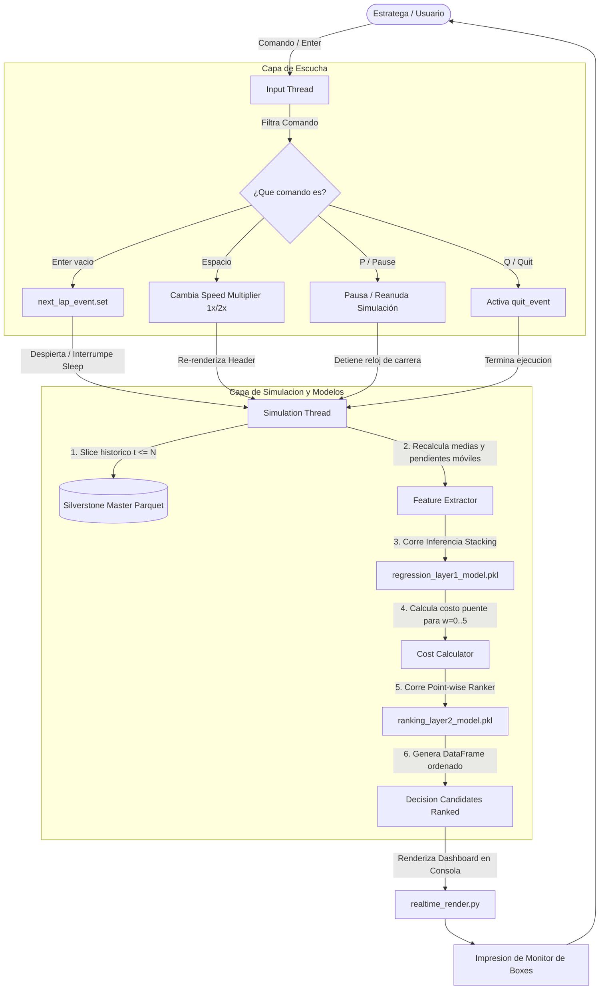

# Reporte Técnico: Simulador del Muro de Boxes en Tiempo Real (GP de Silverstone)

Este reporte detalla el diseño, la arquitectura de ejecución y el fundamento científico del **Simulador del Muro de Boxes en Tiempo Real**, desarrollado en el directorio `project/demo/realtime_demo/`.

---

## 1. Introducción y Propósito

El objetivo principal de esta demostración es recrear las condiciones operativas y las presiones temporales de un **Ingeniero de Estrategia Jefe** durante un Gran Premio de Fórmula 1. 

A diferencia de los análisis *offline* clásicos, este simulador ejecuta una carrera en vivo vuelta a vuelta, calculando métricas dinámicas y ejecutando inferencia en cascada de los modelos de Machine Learning (Capa 1 y Capa 2) en tiempo real, permitiendo al estratega interactuar con la velocidad del simulador e interrumpir lapsos para tomar decisiones críticas.

---

## 2. Arquitectura del Software (Cómo Funciona)

La aplicación está diseñada con un enfoque **multihilo (multithreading)** para permitir que la captura de comandos de teclado del usuario no detenga ni congele el avance del reloj de la carrera.

```text
project/demo/realtime_demo/
├── realtime_pipeline.py    # Extracción de telemetría y predicción en cascada en vivo
├── realtime_render.py      # Renderizado del dashboard de boxes en consola (ASCII y colores)
├── realtime_simulation.py  # Hilo de simulación y lógica de cronómetro de 3s/Enter
└── run_realtime_demo.py    # Punto de entrada interactivo
```

### El Mecanismo de Sincronización y Control Híbrido:
Para lograr que la carrera avance de forma automática por tiempo, pero permita transiciones instantáneas al presionar una tecla, se implementó una cola de sincronización con `threading.Event`:

1.  **Hilo de Escucha (Input Thread):** Se ejecuta en segundo plano. Escucha lecturas bloqueantes del standard input (`sys.stdin.readline()`).
    *   Si detecta un `Enter` vacío, activa el evento de sincronización (`next_lap_event.set()`).
    *   Si detecta la palabra `space` o la barra espaciadora, cambia el multiplicador de velocidad (`speed_multiplier` entre `1.0` y `2.0`) y vuelve a pintar el marco.
    *   Si detecta `p` o `pause`, detiene temporalmente el avance del reloj.
2.  **Hilo de Simulación (Main Thread):**
    *   En cada iteración de la vuelta, limpia la terminal y renderiza el monitor de boxes actualizado.
    *   Calcula el tiempo de espera dinámico:
        $$T_{\text{sleep}} = \frac{3.0}{\text{speed\_multiplier}}$$
    *   Bloquea la ejecución en el evento con un tiempo de espera (*timeout*): `next_lap_event.wait(timeout=T_sleep)`.
    *   Si el usuario presiona `Enter` antes de que se cumpla el tiempo de espera, el evento se activa y el simulador avanza de vuelta **instantáneamente** sin esperar a que termine el temporizador. De lo contrario, avanza de vuelta automáticamente tras el vencimiento del timeout (3.0s o 1.5s).

---

## 3. Diagrama del Pipeline en Tiempo Real

El siguiente diagrama detalla el flujo de información e interacciones entre los hilos de simulación, de entrada y la base de datos de telemetría:



---

## 4. Fundamento Científico: Cero Fugas de Información (No Lookahead Bias)

En los análisis offline tradicionales, las características se calculan sobre el dataset completo antes del entrenamiento. En un entorno de producción o carrera real, esto causaría **fuga de datos futuros (lookahead bias)**, ya que los modelos conocerían de antemano si un Safety Car o una bandera amarilla ocurrió en vueltas posteriores.

### Cómo lo resuelve el simulador:
1.  **Partición Estricta del Tiempo:**
    En la vuelta $N$, el simulador filtra el DataFrame maestro de Silverstone para aislar el historial:
    $$\mathcal{D}_{\text{history}} = \{ \text{registro}_t \mid t \le N \}$$
    Ningún dato de la vuelta $N+1$ en adelante ingresa al pipeline de cálculo de características o de predicción.
2.  **Cálculo de Características Dinámicas (On-the-Fly):**
    A partir de $\mathcal{D}_{\text{history}}$, el extractor calcula dinámicamente las variables de tendencia temporal basadas únicamente en la ventana móvil de las últimas 3 vueltas completadas $[N-2, N-1, N]$:
    *   **Ritmo Promedio Reciente (`lap_mean_3`):** Promedio de duración de las últimas 3 vueltas.
    *   **Consistencia de Conducción (`lap_std_3`):** Desviación estándar de los tiempos de vuelta (detecta si el ritmo es errático).
    *   **Pendiente de Ritmo (`lap_slope_3`):** Tendencia de aceleración o desaceleración calculada mediante la pendiente de mínimos cuadrados.
    *   **Tasa de Degradación Térmica (`deg_rate_3lap`):** Pendiente del ritmo de la vuelta en relación con la mejor vuelta del stint (`lap_vs_best_stint`), indicando si la degradación de los neumáticos está acelerándose.
3.  **Inferencia en Cascada Pura:**
    Con estas características limpias de futuro, los modelos realizan predicciones en vivo, entregando al estratega una estimación realista del costo estratégico de continuar en pista y el score de éxito de la ventana de boxes.
