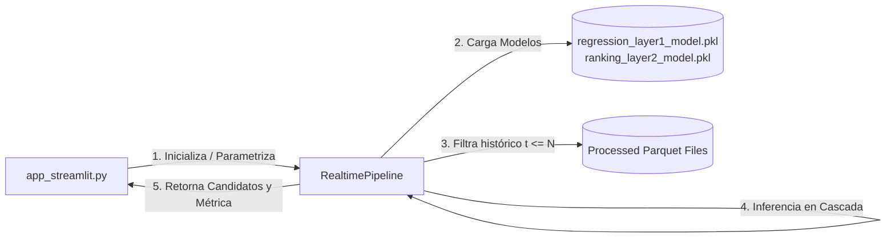

# Reporte Técnico: Asistente Táctico Interactivo en Tiempo Real con Streamlit

Este documento detalla el diseño, la interfaz de usuario y la integración del **Asistente Táctico de Estrategia de Pit Stops** desarrollado con Streamlit en `project/demo/realtime_demo/app_streamlit.py`. Esta aplicación complementa al simulador de consola CLI y ofrece a los ingenieros de pista un muro de boxes visual, interactivo y moderno.

---

## 1. Introducción y Propósito

El objetivo del frontend de Streamlit es traducir el complejo flujo de inferencia en tiempo real de los modelos de Machine Learning (Capa 1 y Capa 2) en una interfaz interactiva de toma de decisiones ("muro de boxes"). 

El sistema permite que un estratega analice escenarios dinámicos simulados vuelta a vuelta para cualquier piloto del conjunto de datos, visualice métricas de telemetría y evalúe la prioridad contrafáctica de parar en boxes o mantenerse en pista en tiempo real.

---

## 2. Arquitectura de Integración con el Backend

El frontend de Streamlit se acopla directamente al motor de simulación sin modificar el backend de la lógica física. 



### Características Clave del Acoplamiento:
1. **Reutilización de Recursos:** Streamlit inicializa `RealtimePipeline` de forma dinámica pasándole la carrera (`race_name`) y el piloto (`driver_acronym`).
2. **Caché Eficiente:** Para evitar sobrecargas al recargar la app por cambios de estado, se implementa `@st.cache_data` para el escaneo de archivos del Gran Premio (`list_races`) y la lectura de pilotos disponibles (`available_drivers`), y `@st.cache_resource` para el pipeline completo de carga de modelos (`get_pipeline`).
3. **Cero Fugas de Información:** Se respeta rigurosamente la partición del tiempo. En la vuelta $N$, la interfaz solo dibuja y predice sobre el subconjunto de datos acumulado hasta la vuelta actual, preservando la validez metodológica.

---

## 3. Componentes de la Interfaz de Usuario (UI/UX)

La aplicación utiliza un diseño premium con temática oscura (`#0e1117`) y estilos CSS personalizados para emular la telemetría de la Fórmula 1 moderna.

### A. Barra Lateral: Configuración de la Carrera y Simulación
* **Gran Premio:** Menú desplegable que escanea la carpeta `data/processed/master` para listar los Grandes Premios con datos maestros reconstruidos (p. ej., Australia, China, Japón, Estados Unidos).
* **Piloto:** Menú que lee automáticamente los pilotos presentes en la telemetría de la carrera seleccionada. Incluye mapeos automáticos de números a acrónimos (como `VER`, `HAM`, `NOR`, `LEC`).
* **Reproducción Automática (Autoplay):** Interruptor para iniciar la simulación secuencial.
* **Velocidad de Simulación:** Control de ritmo (deslizador de 0.2s a 3.0s por vuelta).
* **Vuelta Actual:** Deslizador dinámico que permite avanzar o retroceder manualmente por la carrera vuelta a vuelta.

### B. Muro de Boxes: Monitoreo en Tiempo Real
* **Indicación de Carrera y Vuelta:** Un encabezado estilizado que indica el GP, el acrónimo del piloto y el progreso general de la carrera.
* **Alerta de Datos no Vistos:** Si se selecciona una carrera que no formó parte del entrenamiento de los modelos, la app muestra un aviso amarillo advirtiendo que las inferencias son extrapolaciones.
* **Clasificación en Vivo:** Muestra el Top 5 de la carrera en la vuelta actual de manera compacta para dar contexto posicional.

### C. Métricas de Telemetría Críticas (Tarjetas en Cuadrícula)
Muestra 4 métricas físicas clave en vivo obtenidas del pipeline:
1. **Neumático:** Indica el compuesto actual (`SOFT` en rojo, `MEDIUM` en amarillo, `HARD` en gris claro) utilizando "tyre badges" estilizados con los colores oficiales de la F1.
2. **Edad del Neumático:** Vueltas acumuladas del compuesto actual del piloto en su stint actual.
3. **Posición:** Posición en pista actualizada en la vuelta actual (P1, P2, etc.).
4. **Última Vuelta:** Tiempo exacto del último giro (en segundos).

### D. Banner de Recomendación en Tres Vías
Presenta la recomendación óptima calculada por la Capa 2 (Point-wise Ranker) en una caja estilizada que cambia de color y texto según la prioridad:
* **`[BOX] PARAR AHORA` (Código 0):** Un banner rojo brillante que urge a parar inmediatamente. Muestra el costo físico proyectado por la Capa 1 (`predicted_cost_of_staying`) si decide mantenerse fuera.
* **`[STAY] MANTENER POSICIÓN — VENTANA ÓPTIMA EN K VUELTAS` (Códigos 1..5):** Un banner verde que aconseja esperar. Indica cuántas vueltas restar para la parada recomendada y el costo estratégico de degradación acumulado.
* **`[STAY OUT] MANTENER EN PISTA — NO PARAR EN LA VENTANA` (Código 6):** Un banner verde que indica que la acción recomendada es permanecer en pista durante toda la ventana de predicción (sin paradas previstas en las próximas 5 vueltas).

### E. Sección Contrafactual e Historial
* **Tabla de Decisiones Alternativas (Izquierda):** Muestra de forma transparente las 7 acciones evaluadas por el recomendador (Parar ahora, Esperar 1, 2, 3, 4, 5 vueltas, o NO PARAR). Indica el *Score de Éxito* y el *Costo Acumulado Estimado (s)* para cada una.
* **Gráfico de Scores de Éxito:** Un gráfico de barras interactivo que compara visualmente la preferencia del ranker para cada una de las opciones contrafácticas.
* **Ritmo del Stint (Derecha):** Un gráfico de línea dinámico que grafica los tiempos de vuelta del stint actual a medida que avanza la carrera, lo que permite al estratega ver si el ritmo está decayendo a causa de la degradación.

---

## 4. Mitigación del Sesgo con la Acción `NO_PIT` (Código 6)

El desarrollo del frontend de Streamlit hace visible la implementación de la acción explícita `NO_PIT`:
* **El Problema Original:** Anteriormente, el recomendador solo evaluaba offsets `0..5`. En vueltas donde el piloto no debía parar, la etiqueta real ganadora era `wait_laps = 0` (porque el algoritmo asignaba la mejor puntuación de forma predeterminada al inicio de la ventana). Esto causaba que el ranker aprendiera una regla trivial: "siempre recomendar parar ahora".
* **La Solución:** Introducir la acción `NO_PIT` (código 6) para representar quedarse fuera deliberadamente. La interfaz de Streamlit muestra cómo el ranker prioriza esta opción en el 90% de la carrera, activando la advertencia `BOX` u opciones `STAY` únicamente en ventanas realistas de parada, corrigiendo así el sesgo por completo.

---

## 5. Instrucciones de Ejecución

Para iniciar el muro de boxes interactivo de Streamlit, ejecute el siguiente comando desde la carpeta del proyecto (`project/`):

```bash
streamlit run demo/realtime_demo/app_streamlit.py
```

### Requisitos:
* Tener activado el entorno virtual (`venv`).
* Contar con las dependencias instaladas (`pip install -r requirements.txt`).
* Los modelos y datos procesados deben estar generados (haber ejecutado los pasos del 1 al 5 en el `runbook.md`).

---

## 6. Conclusiones y Futuro del Asistente

El frontend con Streamlit demuestra que es posible llevar un pipeline científico de datos a un nivel de demostración industrial y de fácil acceso. El uso de banners de decisión simplifica la lectura de datos complejos para un tomador de decisiones bajo estrés, mientras que los gráficos contrafácticos y las métricas de telemetría proveen el sustento cuantitativo necesario para auditar y confiar en las recomendaciones de la Inteligencia Artificial.
