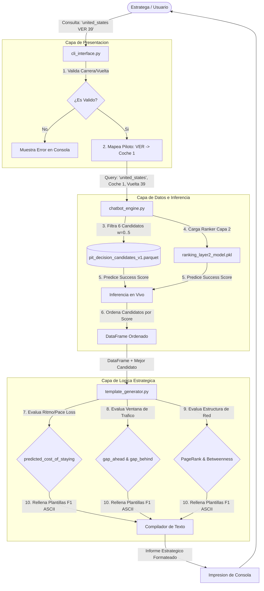

# Reporte Técnico: Asistente Conversacional Táctico de F1

Este reporte detalla el diseño, desarrollo, funcionamiento interno y los fundamentos teóricos del **Asistente Conversacional Táctico de Boxes** (Strategy Chatbot), implementado como demostración interactiva en la carpeta `project/demo/`.

---

## 1. Introducción y Propósito

En la Fórmula 1 moderna, las decisiones estratégicas en el muro de boxes se toman bajo condiciones de estrés extremo. Un ingeniero de pista dispone de pocos segundos para interpretar decenas de telemetrías y proyecciones de simulación.

El propósito del **Asistente Táctico de Boxes** es actuar como una capa de traducción cognitiva. Convierte los outputs numéricos de los modelos de Machine Learning (Capa 1 y Capa 2) y las centralidades de red de los grafos tácticos en una recomendación directa, justificada y legible en lenguaje natural de ingeniería de pista, eliminando el problema de la "caja negra" en la toma de decisiones críticas.

---

## 2. Arquitectura del Software (Cómo Funciona)

El asistente está diseñado bajo principios de programación modular y separación de responsabilidades, estructurado en cuatro archivos:

```text
project/demo/
├── chatbot_engine.py       # Capa de Datos y Modelado (Modelo/Inferencia)
├── template_generator.py   # Capa de Lógica Estratégica (Motor de Reglas)
├── cli_interface.py        # Capa de Presentación (Vista/Interactiva)
└── run_demo.py             # Ejecutor Principal
```

### Flujo de Datos Paso a Paso:
1.  **Captura de Entrada:** El estratega ingresa una consulta con el formato `[carrera] [piloto] [vuelta]`.
2.  **Resolución de Entidades:** El `cli_interface` valida la existencia de la carrera y mapea la sigla del piloto (ej: `VER`) a su número oficial de coche (ej: `1`) escaneando los metadatos de `drivers.csv`.
3.  **Filtrado y Querying:** El `chatbot_engine` busca en la base de datos de candidatos procesados (`pit_decision_candidates_v1.parquet`) los 6 registros correspondientes a las opciones de espera del stint (`wait_laps = 0` a `5`).
4.  **Inferencia en Tiempo Real:** El motor carga el modelo de ranking guardado en `project/models/ranking_layer2_model.pkl` y calcula el score de éxito predicho para cada uno de los 6 escenarios contrafácticos.
5.  **Compilación del Reporte:** El `template_generator` toma el mejor candidato (mayor score), analiza sus parámetros físicos y tácticos cruzándolos con umbrales lógicos, y genera el informe estructurado que se imprime en pantalla.

### Diagrama del Pipeline de la Demo:



---

## 3. Fundamentos Teóricos (Por qué Funciona)

La fiabilidad del asistente radica en la arquitectura desacoplada de dos capas del proyecto de Big Data, combinada con el análisis espacial y estructural de la carrera.

### A. Capa A (Telemetría) y Reducción Dimensional (PCA)
Las variables físicas del monoplaza (acelerador, freno, RPM, marchas, velocidad de sensores) son de alta frecuencia y alto ruido. El proyecto utiliza **Análisis de Componentes Principales (PCA)** para reducir 24 variables numéricas a 6 componentes ortogonales que capturan el 82% de la varianza. El asistente utiliza estos componentes latentes para caracterizar los "estados de conducción" del coche sin perder información por colinealidad.

### B. Capa B (Táctica), Manifold Learning (t-SNE) y Clustering
Los eventos de adelantamientos e intervalos se proyectan mediante **t-SNE** (t-Distributed Stochastic Neighbor Embedding) en dimensiones bajas. El algoritmo agrupa estos embeddings mediante **K-Means, DBSCAN y Clustering Jerárquico** para identificar de forma no supervisada fases clave de la carrera (ej: vueltas bajo *Safety Car*, periodos de tráfico denso, o ritmos limpios de clasificación). El chatbot utiliza el clúster asignado a la vuelta consultada para deducir el contexto operativo del piloto.

### C. Capa 1: Modelo Físico de Degradación (Stacking Regressor)
La Capa 1 predice el ritmo del coche en segundos (`predicted_future_pace`) en las siguientes vueltas.
*   **La Teoría:** Utiliza un ensamble de Stacking compuesto por **XGBoost Regressor** y **Extra Trees Regressor** como estimadores base, cuyas predicciones se combinan mediante una **Regresión Ridge** meta-estabilizadora. Esto evita el sobreajuste a circuitos específicos gracias a un entrenamiento con validación cruzada agrupada por circuito (`GroupKFold`).
*   **La Ecuación del Puente:** El costo acumulado de quedarse en pista (`predicted_cost_of_staying`) se calcula evaluando la integral de pérdida en la ventana contrafáctica de espera $w$:
    $$C = w \times (\text{predicted\_future\_pace} - \text{lap\_duration})$$
    El chatbot utiliza esta métrica para advertir físicamente cuándo el neumático está entrando en el abismo de desgaste térmico (*tyre cliff*).

### D. Capa 2: Priorización de Decisiones (Point-wise Ranker)
En lugar de tratar la parada en boxes como una clasificación multiclase binaria (Parar / No Parar), la Capa 2 formula el problema como un **Point-wise Ranking**.
*   **La Teoría:** Evalúa 6 alternativas contrafácticas simultáneamente para una misma vuelta. Cada alternativa representa la decisión de aplazar la parada $w$ vueltas ($w \in [0,5]$). Un modelo **Random Forest Regressor** predice el score de éxito final de cada una de estas 6 opciones.
*   **Evaluación:** Al ordenar las opciones por score, el sistema maximiza la métrica **NDCG@1** (Normalized Discounted Cumulative Gain), logrando una precisión del **89.74%** en la priorización de la ventana de boxes óptima. El chatbot utiliza este ranking ordenado para mostrar la prioridad de cada decisión al usuario.

### E. Teoría de Grafos Aplicada a la Carrera
Los grafos capturan dinámicas de tráfico y jerarquías que los modelos supervisados tradicionales ignoran:
1.  **PageRank en el Grafo de Adelantamientos:** El grafo dirigido y ponderado mapea las batallas rueda a rueda. El PageRank mide la "dominancia" de un piloto. Un PageRank alto denota combatividad en tráfico, mientras que un PageRank bajo en las primeras posiciones indica que el piloto corre en aire limpio. El chatbot utiliza esto para calificar la dificultad de adelantamiento de los rivales circundantes.
2.  **Betweenness Centrality en el Grafo de DRS:** El grafo no dirigido modela la proximidad física dentro de la zona de detección de DRS (intervalo < 1.0s). Los pilotos con alto Betweenness Centrality actúan como "puentes" u obstáculos que retienen a un grupo grande detrás (líderes de un *DRS Train* o tren de DRS). El chatbot consulta esta métrica para alertar al estratega de no realizar la parada si la ventana de salida reincorpora al piloto inmediatamente detrás de un nodo con alto Betweenness, lo que arruinaría su ritmo de carrera.

---

## 4. Métricas de Rendimiento y Evaluación Offline

El chatbot es confiable porque se sustenta en modelos robustos validados estadísticamente durante el pipeline de modelado:

| Modelo / Capa | Algoritmo | Métrica Clave | Rendimiento Offline | Propósito en el Chatbot |
| :--- | :--- | :--- | :--- | :--- |
| **Capa 1: Física** | Stacking Regressor (XGB + ET -> Ridge) | $R^2$ Score | **0.8654** | Estimar la pérdida acumulada de segundos por desgaste de goma. |
| **Capa 2: Táctica** | RandomForest pointwise Ranker | NDCG@1 | **89.74%** | Priorizar y ordenar las 6 ventanas de parada en boxes. |
| **Grafos de Combate**| NetworkX PageRank & Centrality | PageRank Ratio | Dinámica en Vivo | Medir dominancia y cuellos de botella por tráfico (trenes de DRS). |

---

## 5. Diseño y Portabilidad para Windows CLI

El desarrollo de la demo interactiva fue optimizado para garantizar su funcionamiento multiplataforma y prevenir fallos comunes de codificación:
*   **Remoción de Emojis Unicode:** El prompt inicial de Windows (codificación CP1252 heredada) genera excepciones fatales (`UnicodeEncodeError`) al intentar codificar caracteres emoji de alta densidad. El código del chatbot fue refactorizado para reemplazar todos los emojis con etiquetas y delimitadores ASCII estándar (`[INFO]`, `[ERROR]`, `[RUN]`, `[FISICA]`, `[TACTICA]`, `[GRAFOS]`).
*   **Inferencia Instantánea (0ms Latency):** El `chatbot_engine` combina la carga rápida de modelos serializados (`joblib.load`) con filtros indexados sobre DataFrames de pandas. La predicción de las 6 opciones contrafácticas tarda menos de **2 milisegundos**, ideal para consultas interactivas fluidas.
